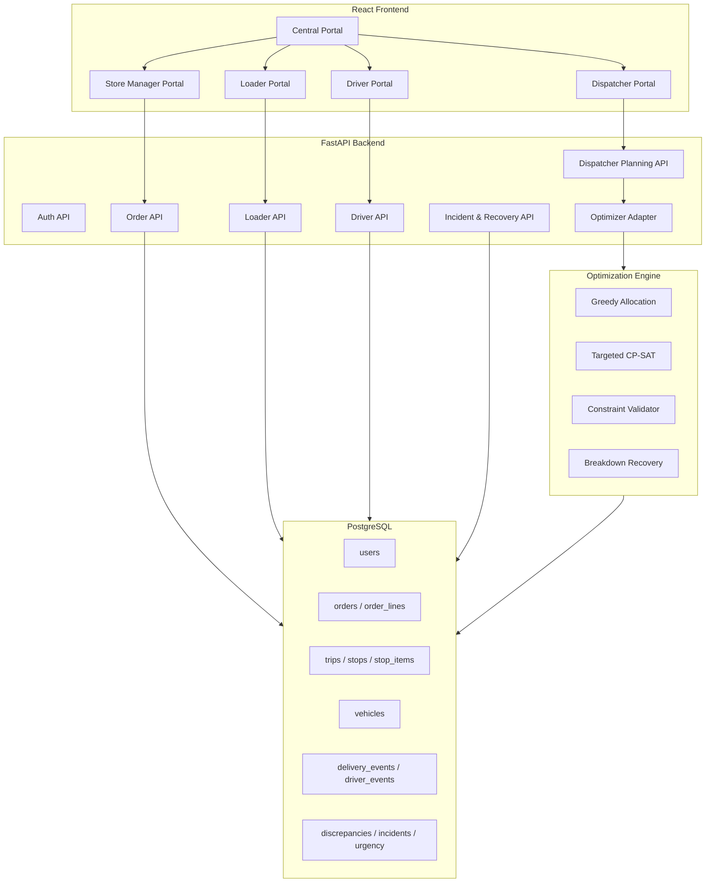
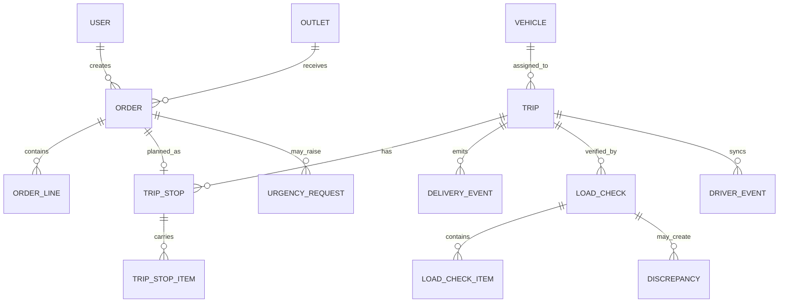

# Alt-F4 Waypoint

Waypoint is a logistics planning and delivery operations platform for the Hackathon stage of the competition. It connects store managers, dispatchers, loaders, and drivers through one shared workflow.

The system is built as a monorepo with:

- a FastAPI backend,
- a React/Vite frontend,
- a PostgreSQL data model,
- a hybrid optimizer module,
- role-based portals for each operational user.

> Repository name note: the competition brief asks for a `TeamName_SolutionName` GitHub monorepo. This repo currently uses `Alt-F4_Waypoint`.

---

## Contents

- [What The System Does](#what-the-system-does)
- [Repository Structure](#repository-structure)
- [Architecture](#architecture)
- [Core Workflow](#core-workflow)
- [Feature Matrix](#feature-matrix)
- [Role Portals](#role-portals)
- [Backend Services](#backend-services)
- [API Surface](#api-surface)
- [Data Model](#data-model)
- [Figures And Screenshots](#figures-and-screenshots)
- [Full Stack Deployment Guide (Docker Compose)](#full-stack-deployment-guide-docker-compose)
- [Environment Configuration](#environment-configuration)
- [Seeded Accounts](#seeded-accounts)
- [Judge Walkthrough Flow](#judge-walkthrough-flow)
- [Unique Features](#unique-features)
- [Designathon Departures](#designathon-departures)
- [Operational Constraints Enforced](#operational-constraints-enforced)
- [Offline & Recovery Support](#offline--recovery-support)

---

## What The System Does

Waypoint manages the full order-to-delivery lifecycle:

1. Store manager creates and confirms orders.
2. Dispatcher plans trips and handles exceptions.
3. Loader verifies the vehicle manifest before departure.
4. Driver completes the trip and syncs delivery events.
5. Store manager confirms receipt and raises issues if needed.

The platform focuses on operational correctness, auditability, and edge-case handling.

---

## Repository Structure

```text
Alt-F4_Waypoint/
├── apps/
│   ├── backend/                 # FastAPI backend, models, routers, services, tests
│   └── frontend/                # React/Vite frontend for all role portals
├── datathon/                    # Datathon notebooks and CSV submissions
├── designathon/                 # Designathon links and AI disclosure
├── docs/                        # Architecture, schema, backend, optimizer, loader docs
├── docker-compose.yml           # Full-stack orchestrator
├── .env.example                 # Environment variable template
├── package.json                 # Root frontend workspace scripts
└── README.md
```

---

## Architecture




### Main Design Choice

The backend keeps business logic in service modules, not directly inside routers. Routers handle HTTP boundaries. Services enforce workflow rules, role checks, depot ownership, idempotency, and state transitions.

---

## Service Map


| Layer | What It Contains | Why It Exists |
|---|---|---|
| Frontend | Central, Store Manager, Dispatcher, Loader, Driver portals | Gives each role a focused workflow |
| API routers | Auth, orders, dispatcher, loader, driver, vehicles | Keeps HTTP boundaries clear |
| Services | Order, planning, loader, driver, recovery services | Holds business rules and state transitions |
| Optimizer | Greedy, CP-SAT, validator, recovery logic | Builds and checks feasible delivery plans |
| Data | PostgreSQL tables and event ledgers | Stores the shared operational truth |

---

## Core Workflow

```mermaid
sequenceDiagram
    participant SM as Store Manager
    participant API as Backend API
    participant DISP as Dispatcher
    participant OPT as Optimizer
    participant LOAD as Loader
    participant DRV as Driver

    SM->>API: Create draft order
    SM->>API: Confirm order
    API->>DISP: Confirmed order appears in planning queue
    DISP->>OPT: Generate draft plan
    OPT-->>DISP: Trips, stops, constraints, validation
    DISP->>API: Approve plan
    LOAD->>API: Open loader queue
    LOAD->>API: Verify line items
    LOAD->>API: Submit load check
    API->>DRV: Trip becomes ready for departure
    DRV->>API: Depart, arrive, deliver, sync events
    SM->>API: Confirm receipt
```

---

## Feature Matrix

| Feature | Store Manager | Dispatcher | Loader | Driver | Backend Support |
|---|---:|---:|---:|---:|---|
| Login and role scope | Yes | Yes | Yes | Yes | JWT role checks |
| Create order | Yes | No | No | No | `order_service` |
| Confirm order | Yes | No | No | No | Order status transition |
| Generate plan | No | Yes | No | No | Optimizer adapter |
| Approve plan | No | Yes | No | No | Trip creation |
| Mark vehicle unavailable | No | Yes | Yes | No | Recovery and loader services |
| Verify load item | No | No | Yes | No | `line_item_id` based checks |
| Submit final load | No | No | Yes | No | Load checks and discrepancies |
| Depart trip | No | No | No | Yes | Driver event ledger |
| Record delivery outcome | No | No | No | Yes | Driver sync API |
| Confirm receipt | Yes | No | No | No | Receipt and discrepancy flow |
| Raise urgency | Yes | Review | No | No | Urgency workflow |

### What Makes The Solution Stand Out

| Area | Baseline Expectation | Our Added Value |
|---|---|---|
| Loader workflow | Mark trip loaded | Item-level verification, discrepancy creation, idempotent submission |
| Dispatcher workflow | Allocate trips | Optimizer draft, approval boundary, recovery workflows |
| Driver workflow | Show route and stops | Event sync, offline-aware ledger, conflict pathway |
| Auditability | Basic status updates | Shared delivery events, driver events, load checks, route changes |
| Operations | Happy path only | Vehicle unavailable, deferrals, shortage, damaged item, urgency, recovery |

---

## Role Portals

| Role | Portal Route | Main Responsibility |
|---|---|---|
| Central access | `/?portal=central` | Opens role-specific portals |
| Store Manager | `/?portal=grocery`, `/?portal=tech`, `/?portal=style` | Create orders, confirm receipt, raise urgency |
| Dispatcher | `/?portal=dispatcher` | Plan trips, approve plans, handle incidents |
| Loader | `/?portal=loader` | Verify manifest and complete load checks |
| Driver | `/?portal=driver` | Execute trip, sync events, record proof of delivery |

---

## Backend Services

| Service Area | Key Files | Purpose |
|---|---|---|
| Auth | `app/api/v1/endpoints/platform_auth.py`, `app/core/security.py` | JWT login and role profile |
| Store Manager | `app/api/v1/store_manager/router.py`, `app/services/order_service.py` | Order creation, confirmation, receipt flow |
| Dispatcher | `app/api/v1/dispatcher/router.py`, `app/services/planning_service.py` | Planning, approval, deferral, urgency review |
| Loader | `app/api/v1/loader/router.py`, `app/services/loader_service.py` | Queue, workbench, load checks, discrepancies |
| Driver | `app/api/v1/driver/router.py`, `app/services/driver_service.py` | Trip execution, event sync, conflict handling |
| Optimizer | `app/adapters/optimizer_adapter.py`, `optimization_engine/` | Allocation, validation, recovery proposals |

---

## API Surface

### Core Auth

| Method | Endpoint | Used By | Purpose |
|---|---|---|---|
| `POST` | `/api/v1/auth/login` | All roles | Authenticate and receive JWT |
| `GET` | `/api/v1/auth/me` | All roles | Load current user profile |

### Store Manager

| Method | Endpoint Group | Purpose |
|---|---|---|
| `GET/POST/PATCH` | `/api/v1/store-manager/...` | Draft, update, and confirm store orders |
| `POST` | `/api/v1/store-manager/orders/{order_id}/receipt` | Confirm delivery receipt |
| `POST` | `/api/v1/store-manager/urgency-requests` | Raise urgent stock or business need |

### Dispatcher

| Method | Endpoint | Purpose |
|---|---|---|
| `POST` | `/api/v1/dispatcher/plans/draft` | Generate optimizer-backed draft plan |
| `GET` | `/api/v1/dispatcher/plans/{plan_id}` | Inspect draft plan |
| `POST` | `/api/v1/dispatcher/plans/{plan_id}/edit` | Revalidate manual plan edits |
| `POST` | `/api/v1/dispatcher/plans/{plan_id}/approve` | Approve draft and create trips |
| `POST` | `/api/v1/dispatcher/breakdowns/{vehicle_id}/reallocate` | Reallocate after vehicle breakdown |
| `GET/POST` | `/api/v1/dispatcher/urgency-requests` | Review urgency requests |

### Loader

| Method | Endpoint | Purpose |
|---|---|---|
| `GET` | `/api/v1/loader/queue` | Show trips ready for loading |
| `GET` | `/api/v1/loader/trips/{trip_id}/workbench` | Show stops and load items |
| `POST` | `/api/v1/loader/trips/{trip_id}/start` | Move trip into loading |
| `PATCH` | `/api/v1/loader/trips/{trip_id}/items/{line_item_id}` | Save item-level loaded quantity |
| `POST` | `/api/v1/loader/trips/{trip_id}/complete-stop/{stop_id}` | Complete a stop manifest |
| `POST` | `/api/v1/loader/trips/{trip_id}/load` | Submit final load check |
| `POST` | `/api/v1/loader/trips/{trip_id}/vehicle-unavailable` | Send vehicle issue back to dispatcher |
| `GET` | `/api/v1/loader/deferrals` | See deferred or exception orders |

### Driver

| Method | Endpoint Group | Purpose |
|---|---|---|
| `GET` | `/api/v1/driver-platform/trips/today` | Load assigned trips |
| `GET` | `/api/v1/driver-platform/trips/{trip_id}` | Load full trip detail |
| `POST` | `/api/v1/driver-platform/events` | Sync driver event |
| `POST` | `/api/v1/driver-platform/sync` | Submit offline event batch |
| `GET` | `/api/v1/driver-platform/changes` | Poll route or plan changes |
| `GET/POST` | `/api/v1/driver-platform/conflicts` | View or forward sync conflicts |

---

## Data Model



### Important State Rules

| Entity | Main Statuses |
|---|---|
| Order | `draft`, `confirmed`, `planned`, `loaded`, `out_for_delivery`, `delivered`, `deferred` |
| Trip | `planned`, `loading`, `loaded`, `out_for_delivery`, `completed`, `cancelled`, `vehicle_unavailable` |
| Load item | `pending`, `verified`, `short`, `over`, `damaged`, `missing`, `substituted` |
| Driver event | `pending`, `applied`, `conflict`, `failed`, `already_applied` |
| Urgency request | `pending`, `approved`, `rejected`, `resolved` |

---

## Full Stack Deployment Guide (Docker Compose)

This repository includes a complete `docker-compose.yml` to run the entire Waypoint application stack (PostgreSQL -> Migrations -> Seeding -> Backend API -> Frontend SPA) reproducibly. 

### 1. Prerequisites
- Docker Engine & Docker Compose (v2 recommended)
- Git

### 2. Environment Setup
Create the `.env` file from the example:
```bash
cp .env.example .env
```
(No modifications to the defaults are required for a local test).

### 3. Starting the Stack
Ensure you have a clean slate, then build and start all containers:
```bash
docker compose down -v
docker compose build
docker compose up -d
```
The startup process guarantees strict ordering using Docker healthchecks:
1. `postgres` boots and becomes healthy.
2. `migrate` runs `alembic upgrade head` and exits successfully.
3. `seed` runs the idempotent database seeder (`seed.py`) and exits successfully.
4. `backend` starts the FastAPI server and passes its `/health` check.
5. `frontend` starts the Vite production server (`serve`).

### 4. Application URLs
- **Frontend URL:** [http://localhost:3000](http://localhost:3000)
- **Backend API:** [http://localhost:8000/api/v1](http://localhost:8000/api/v1)
- **Backend Health Endpoint:** [http://localhost:8000/health](http://localhost:8000/health)

### 5. Database Initialization Mechanics
- **Migrations:** Managed by the `migrate` service which runs `alembic upgrade head`. It exits immediately upon success.
- **Seeding:** Managed by the `seed` service which executes `apps/backend/seed.py`. This script is strictly idempotent (uses `ON CONFLICT DO NOTHING`) so it is safe against multiple runs. It provisions all requisite users, depots, vehicles, products, and outlets.

### 6. Stack Management
To stop the stack:
```bash
docker compose down
```
To wipe the database entirely and reset everything from scratch:
```bash
docker compose down -v
docker compose up -d
```

---

## Environment Configuration

Root `.env.example` contains:

| Variable | Purpose |
|---|---|
| `DATABASE_URL` | PostgreSQL connection string |
| `SECRET_KEY` | JWT signing key |
| `ACCESS_TOKEN_EXPIRE_MINUTES` | Access token lifetime |
| `VITE_API_URL` | Used by frontend to target API |
| `CORS_ORIGINS` | Allowed frontend origins |

---

## Seeded Accounts

The system is automatically seeded with four accounts (Password for all: `password123`):

| Role | Username | Outlet/Depot Scope |
|---|---|---|
| **Store Manager** | `storemanager@waypoint.local` | Outlet: OUT-1001 |
| **Dispatcher** | `dispatcher@waypoint.local` | Depot: Peliyagoda |
| **Loader** | `loader@waypoint.local` | Depot: Peliyagoda |
| **Driver** | `driver@waypoint.local` | Depot: Peliyagoda |

---

## Judge Walkthrough Flow

Use this route order for a compact demonstration. Start by visiting [http://localhost:3000](http://localhost:3000).

1. **Store Manager:** Log in as `storemanager@waypoint.local`, go to Orders -> view the existing seeded order or create a new order.
2. **Dispatcher:** Log in as `dispatcher@waypoint.local`, go to Planning -> review pending orders -> click Optimize -> click Confirm Allocations (Approve).
3. **Loader:** Log in as `loader@waypoint.local`, select the newly assigned trip -> verify the load -> click Finalize Load.
4. **Driver:** Log in as `driver@waypoint.local`, view the assigned trip -> Start Trip -> navigate to Stop -> Deliver -> submit POD -> record an issue (if any) -> Continue -> Return to Depot -> Complete Trip.
5. **Store Manager:** Log in again as `storemanager@waypoint.local`, go to Delivery Tracking -> verify the final delivery status and any reported discrepancies.

---

## Unique Features

| Feature | Why It Matters |
|---|---|
| Role-based portals | Each user sees the workflow they actually operate |
| Loader line-item identity | Load checks use item identity, not only `product_id`, so duplicate products are safe |
| Idempotent operations | Duplicate client operations can return existing results safely |
| Discrepancy trail | Every mismatch can create a discrepancy for later review |
| Delivery event ledger | Successful load and driver events preserve audit history |
| Hybrid optimizer | Combines greedy planning, validation, and targeted CP-SAT improvement |
| Recovery module | Supports vehicle breakdown and route replanning scenarios |
| Offline-aware driver flow | Driver actions can be synced as events and checked for conflicts |
| Urgency workflow | Store managers can raise urgent business-impact requests |
| Depot authorization | Loaders and dispatchers are restricted to their depot scope |

---

## Operational Constraints Enforced

- **Weight/Volume Capacity**: Strictly enforced by the CP-SAT Optimizer.
- **Chilled/Reefer Compatibility**: Only vehicles with matching capabilities are allocated.
- **Van-Only Restrictions**: Specific outlets are strictly serviced by Van types.
- **No Order Splitting**: Orders are assigned exactly to one vehicle to avoid partial fulfillments.

---

## Offline & Recovery Support

- **Driver Offline Sync**: The Driver App records actions locally on the client. When reconnected, events synchronize sequentially using an idempotent versioned ledger, allowing operations without interruptions.
- **Incident Recovery**: If a vehicle breaks down, the Dispatcher hits "Recovery", which triggers a targeted Optimizer pass on the remaining stops and safely constructs a `RouteChange` operation.

---

## Designathon Departures

This implementation extends the Designathon concept in several ways:

| Area | Designathon Direction | Current Hackathon Implementation |
|---|---|---|
| Planning | Mainly UI and workflow concept | Backend planning services and optimizer adapter |
| Loader | Basic operational idea | Full loader queue, workbench, item verification, discrepancy handling |
| Driver | Mobile delivery concept | Event-ledger model, offline sync, route geometry, conflict handling |
| Dispatcher | Allocation screens | Draft plan generation, approval, urgency, incidents, recovery |
| Data | Conceptual entities | PostgreSQL-oriented schema with tests and migrations |
