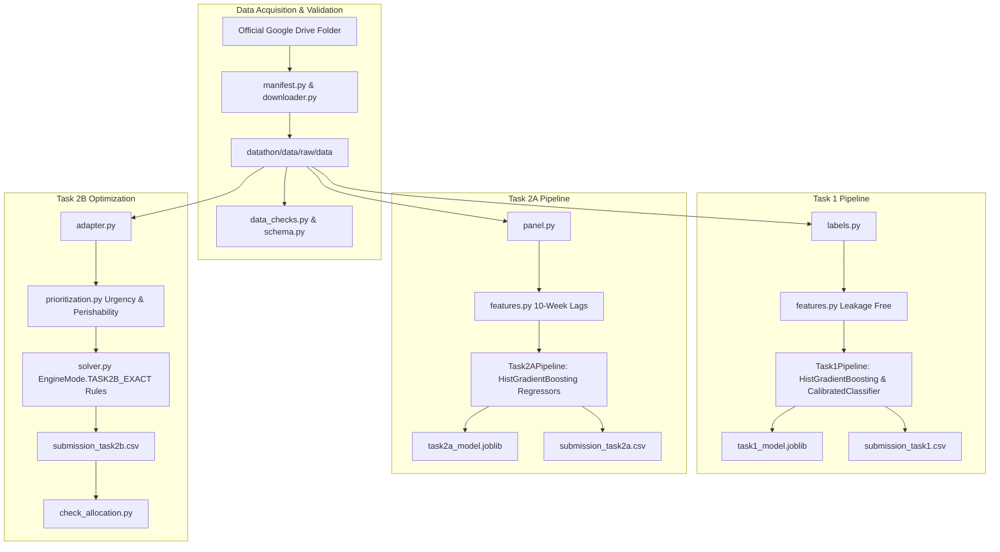
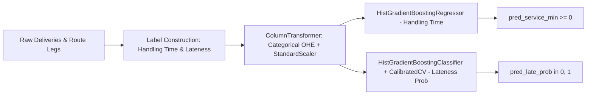
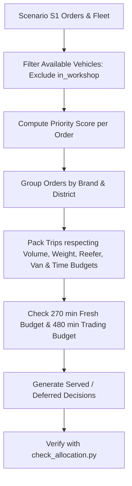

# Datathon Architecture & Solution Design

## 1. End-to-End System Architecture

```mermaid
flowchart TD
    subgraph Data Acquisition & Validation
        A[Official Google Drive Folder] --> B[manifest.py & downloader.py]
        B --> C[datathon/data/raw/data]
        C --> D[data_checks.py & schema.py]
    end

    subgraph Task 1 Pipeline
        C --> E[labels.py]
        E --> F[features.py Leakage Free]
        F --> G[Task1Pipeline: HistGradientBoosting & CalibratedClassifier]
        G --> H[task1_model.joblib]
        G --> I[submission_task1.csv]
    end

    subgraph Task 2A Pipeline
        C --> J[panel.py]
        J --> K[features.py 10-Week Lags]
        K --> L[Task2APipeline: HistGradientBoosting Regressors]
        L --> M[task2a_model.joblib]
        L --> N[submission_task2a.csv]
    end

    subgraph Task 2B Optimization
        C --> O[adapter.py]
        O --> P[prioritization.py Urgency & Perishability]
        P --> Q[solver.py EngineMode.TASK2B_EXACT Rules]
        Q --> R[submission_task2b.csv]
        R --> S[check_allocation.py]
    end
```

---

## 2. Task 1 ML Pipeline Architecture

```mermaid
flowchart LR
    A[Raw Deliveries & Route Legs] --> B[Label Construction: Handling Time & Lateness]
    B --> C[ColumnTransformer: Categorical OHE + StandardScaler]
    C --> D1[HistGradientBoostingRegressor - Handling Time]
    C --> D2[HistGradientBoostingClassifier + CalibratedCV - Lateness Prob]
    D1 --> E1[pred_service_min >= 0]
    D2 --> E2[pred_late_prob in 0, 1]
```

---

## 3. Task 2B Solver Flowchart

```mermaid
flowchart TD
    A[Scenario S1 Orders & Fleet] --> B[Filter Available Vehicles: Exclude in_workshop]
    B --> C[Compute Priority Score per Order]
    C --> D[Group Orders by Brand & District]
    D --> E[Pack Trips respecting Volume, Weight, Reefer, Van & Time Budgets]
    E --> F[Check 270 min Fresh Budget & 480 min Trading Budget]
    F --> G[Generate Served / Deferred Decisions]
    G --> H[Verify with check_allocation.py]
```
