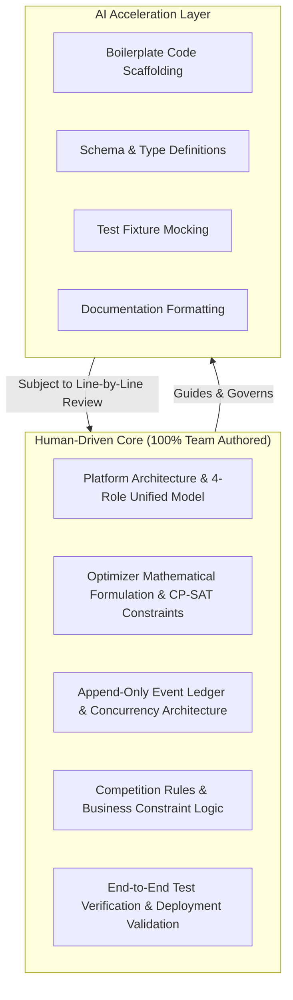

# AI Disclosure Statement

**Project:** Alt-F4 Waypoint  
**Competition:** Tech-Triathlon 2026 — Hackathon Stage  
**Team:** Alt-F4  
**Date:** October 2026  

---

## 1. Overview & Policy Compliance

In full accordance with the **Tech-Triathlon 2026 Hackathon** submission guidelines and ethical AI principles, this document transparently discloses the scope, tooling, methodology, and extent of Artificial Intelligence (AI) assistance utilized during the development of the **Alt-F4 Waypoint** platform.

The Alt-F4 team maintains full ownership, accountability, and responsibility for the architecture, system logic, algorithmic designs, and final source code submitted in this repository.

---

## 2. Human Responsibility & Review Statement

> **Core Commitment:**  
> All AI tools were employed strictly as assistive pair-programming, exploratory, and documentation accelerators. **Every line of AI-suggested code, schema definition, configuration, and documentation underwent rigorous human inspection, manual review, syntax compilation, and functional test execution before being merged into the codebase.**

Human team members independently directed:
1. High-level architectural trade-offs and domain boundary definitions.
2. Formulation of the mathematical and heuristic optimization objectives.
3. Business rule interpretations and competition compliance.
4. Final verification across Docker containers, database migrations, and end-to-end operational workflows.

---

## 3. AI Tools Utilized

The table below details the specific AI systems used during the hackathon lifecycle:

| Tool / Model | Primary Context & Use Case | Interaction Mode |
|---|---|---|
| **Google Antigravity** | In-IDE agentic pair programming; multi-file codebase navigation; scaffolding endpoints, tests, and documentation. | Interactive IDE dialogue & workspace tool execution |
| **OpenAI ChatGPT / Claude** | Algorithmic brainstorming, Python/React syntax references, RegEx patterns, KaTeX/Mermaid syntax verification. | Web prompt-and-response queries |
| **GitHub Copilot / IDE Autocomplete** | Line-level boilerplate completion (Pydantic schema attributes, Tailwind class combinations, repetitive JSX elements). | Inline code completion |

---

## 4. AI-Assisted Work Categories

AI tools accelerated implementation in the following specific technical vectors:

### 4.1 Boilerplate & Endpoint Scaffolding
- Generated repetitive CRUD router structures in FastAPI (`app/api/v1/`) and matching Pydantic v2 schemas (`app/schemas/`) adhering to human-defined database contracts.
- Scaffolding standard SQLAlchemy 2.0 ORM model attribute definitions based on the approved schema specification.
- Generating standard React component scaffolding and repetitive prop declarations across role portals.

### 4.2 Test Suite Expansion & Fixture Generation
- Drafted Pytest unit and integration test fixtures (`apps/backend/tests/`) based on human-defined testing checklists.
- Generated mock payload permutations to validate edge cases (e.g. invalid date formats, missing JWT claims, unhandled HTTP status codes).

### 4.3 Documentation Synthesis & Diagram Generation
- Assisted in formatting and refining Markdown documentation (`README.md`, `architecture.md`, `data-model.md`).
- Assisted in translating architectural component layouts into Mermaid flowchart and sequence diagram syntax.

### 4.4 Debugging & Build Configuration Troubleshooting
- Accelerated resolution of environment and dependency issues (e.g., Docker Alpine Linux build errors, Vite build argument resolution, Alembic migration dependency ordering).

---

## 5. Purely Human (Non-AI) Work & Intellectual Property

All core intellectual property, critical domain logic, algorithmic decisions, and operational guardrails were conceived, designed, and verified exclusively by human team members:

### 5.1 High-Level Architecture & Domain Design
- The unified four-pillar operational architecture linking **Store Manager**, **Dispatcher**, **Loader**, and **Driver** portals into a single live state machine.
- Scoping rules: Store Managers scoped to outlets (`outlet_id`), while Dispatchers, Loaders, and Drivers are scoped to depots (`depot_id`).
- Security architecture: Stateless JWT claims, password hashing via BCrypt, and database-level role check constraints.

### 5.2 Optimization Engine Design & Constraint Formulation
- The design of the hybrid optimization strategy: combining multi-start greedy daily planning (`hackathon_planner.py`), constraint validation (`validator.py`), and targeted Google OR-Tools CP-SAT refinement (`targeted_cpsat.py`).
- Exact mathematical formulations for vehicle capacity (weight in kg and volume in $m^3$), temperature segregation (reefer vs ambient), dock constraints (`van_only`, `mall_dock`), outlet delivery windows, and weekly driver fuel quotas.
- The breakdown recovery logic (`breakdown_recovery.py`) that isolates orphaned stops during vehicle breakdowns and plans rescue reallocations.

### 5.3 Offline Event-Sourcing & Concurrency Architecture
- The append-only event ledger architecture (`driver_events` and `delivery_events`), ensuring historical driver evidence is immutable.
- The idempotency design utilizing client-generated UUIDs (`client_event_id`) with database-level uniqueness constraints to guarantee safe replay across offline network retries.
- Optimistic concurrency control via monotonic `row_version` tracking on `TripStop` entities, ensuring multi-client conflicts are detected and escalated cleanly.

### 5.4 Business Rules & Operational Policies
- Strict enforcement of the 14:00 LKT order cutoff rule for next-day deliveries.
- Strict separation between ambient and chilled orders (`TempReq = ambient | chilled`).
- No order splitting: ensuring each order is serviced in full by a single vehicle stop.
- Item-level verification identity (`line_item_id`) preventing product ambiguity in mixed manifests.

### 5.5 Final Verification & Deployment Testing
- Running and verifying all test suites across Python 3.11 and Node.js 20.
- Executing clean-slate Docker Compose builds (`docker compose down -v && docker compose up -d`) to ensure automated healthchecks, migrations, and idempotent database seeding run without manual intervention.
- Manually testing the complete 6-step Judge Walkthrough across all four operational portals.

---

## 6. Human Oversight Methodology

The team followed a strict **Human-in-the-Loop (HITL)** engineering workflow for any AI-assisted task:

1. **Human Design & Specification:** The human engineer drafted the schema, API contract, or functional requirement.
2. **AI Drafting / Assistance:** The AI tool suggested code snippets, schema definitions, or test templates.
3. **Critical Line-by-Line Review:** The engineer scrutinized the suggestion for logic flaws, security vulnerabilities, edge-case mishandling, or competition non-compliance.
4. **Refactoring & Modification:** Code was adjusted, optimized, and integrated to match team patterns and coding standards.
5. **Automated & Manual Testing:** Code was compiled, formatted, and passed through automated Pytest suites and manual UI execution before final commit.

---

## 7. Data Privacy & Confidentiality

- No proprietary evaluation benchmarks, undisclosed private dataset keys, or sensitive credentials were provided to or ingested by external AI training pipelines.
- All mock credentials utilized (`password123`) are explicitly non-production demo seeds included strictly for evaluator convenience.
