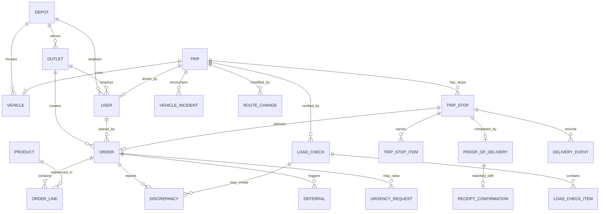
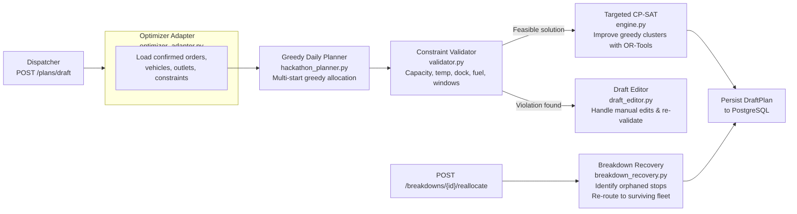
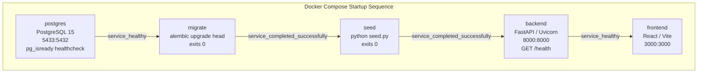

# Waypoint Platform — Architecture

Alt-F4 Waypoint is an enterprise logistics planning and delivery operations platform built for the 2026 Tech-Triathlon Hackathon. It unifies **Store Manager**, **Dispatcher**, **Loader**, and **Driver** roles into a single auditable, end-to-end delivery workflow backed by a hybrid optimizer.

---

## 1. High-Level System Diagram

```mermaid
flowchart TB
    subgraph Client ["Client Layer (React/Vite SPA — Port 3000)"]
        Central["Central Portal\n/?portal=central"]
        SM_Fresh["Store Manager Fresh\n/?portal=grocery"]
        SM_Style["Store Manager Style\n/?portal=style"]
        SM_Tech["Store Manager Tech\n/?portal=tech"]
        Dispatcher["Dispatcher Portal\n/?portal=dispatcher"]
        Loader["Loader Portal\n/?portal=loader"]
        Driver["Driver PWA\n/?portal=driver"]
    end

    Central --> SM_Fresh & SM_Style & SM_Tech & Dispatcher & Loader & Driver

    subgraph API ["FastAPI Backend (Port 8000)"]
        Auth["/api/v1/auth\nPlatform Auth (JWT)"]
        SMRouter["/api/v1/store-manager\nStore Manager Router"]
        DispRouter["/api/v1/dispatcher\nDispatcher Router"]
        LoaderRouter["/api/v1/loader\nLoader Router"]
        DriverRouter["/api/v1/driver-platform\nDriver Platform Router"]
        VehiclesRouter["/api/v1/vehicles\nFleet Router"]
        OrdersRouter["/api/v1/orders\nShared Orders Router"]

        subgraph Services ["Domain Services"]
            OrderSvc["order_service"]
            PlanSvc["planning_service"]
            UrgencySvc["urgency_service"]
            LoaderSvc["loader_service"]
            DriverSvc["driver_service"]
            GeoSvc["geo_service"]
            ManifestSvc["manifest_service"]
            IncidentSvc["dispatcher/incident_service"]
            RecoverySvc["dispatcher/recovery_service"]
            RouteChangeSvc["dispatcher/route_change_service"]
        end

        subgraph Optimizer ["Hybrid Optimization Engine"]
            Adapter["Optimizer Adapter"]
            Greedy["Greedy Daily Planner"]
            CPSAT["Google OR-Tools CP-SAT Solver"]
            Validator["Constraint Validator"]
            Recovery["Breakdown Recovery Engine"]
            DraftEditor["Draft Plan Editor"]
        end
    end

    subgraph Data ["Data Layer"]
        Postgres[("PostgreSQL 15\nPort 5433:5432")]
        Evidence[("Evidence Volume\n/app/data/evidence")]
        Alembic["Alembic Migrations"]
        Seeder["seed.py\nIdempotent Seeder"]
    end

    SM_Fresh & SM_Style & SM_Tech --> Auth & SMRouter
    Dispatcher --> Auth & DispRouter & VehiclesRouter
    Loader --> Auth & LoaderRouter
    Driver --> Auth & DriverRouter

    SMRouter --> OrderSvc & UrgencySvc
    DispRouter --> PlanSvc & UrgencySvc & IncidentSvc & RecoverySvc & RouteChangeSvc
    LoaderRouter --> LoaderSvc
    DriverRouter --> DriverSvc & GeoSvc

    PlanSvc & RecoverySvc --> Adapter
    Adapter --> Greedy & CPSAT & Validator & Recovery & DraftEditor

    OrderSvc & PlanSvc & UrgencySvc & LoaderSvc & DriverSvc & IncidentSvc & RecoverySvc --> Postgres
    DriverSvc --> Evidence
    Alembic & Seeder --> Postgres
```

---

## 2. API Surface Map

### 2.1 Auth — `/api/v1/auth`

| Method | Endpoint | Purpose |
|---|---|---|
| `POST` | `/login` | Authenticate with username + password, return JWT bearer token |
| `GET` | `/me` | Return the authenticated user profile and role claims |

JWT payload includes `sub` (user_id), `role`, `outlet_id`, `depot_id`. All subsequent calls use the bearer token to resolve the user and enforce role access.

---

### 2.2 Store Manager — `/api/v1/store-manager`

| Method | Endpoint | Purpose |
|---|---|---|
| `POST` | `/orders` | Create a new draft order for the manager's outlet |
| `GET` | `/orders` | List all outlet orders (filterable by status, date, brand) |
| `GET` | `/orders/{order_id}` | Get single order details |
| `PUT` | `/orders/{order_id}` | Update item quantities in a draft order |
| `DELETE` | `/orders/{order_id}` | Cancel a draft order before confirmation |
| `POST` | `/orders/{order_id}/confirm` | Confirm order and advance status to `confirmed` |
| `POST` | `/orders/{order_id}/receipt` | Record physical receipt of delivery with item-level discrepancies |
| `GET` | `/orders/{order_id}/eta` | Get live tracking and estimated arrival time |
| `GET` | `/orders/{order_id}/receipt-details` | Get proof-of-delivery and receipt confirmation references |
| `POST` | `/orders/{order_id}/urgency-request` | Submit a business urgency escalation |
| `GET` | `/orders/{order_id}/urgency-request` | Retrieve current urgency request status |
| `GET` | `/products` | Browse active product catalog (filterable by brand, temp_req) |
| `GET` | `/outlet` | Get the manager's assigned outlet details |
| `GET` | `/deferrals` | List deferred orders and dispatcher deferral notices |

---

### 2.3 Dispatcher — `/api/v1/dispatcher`

| Method | Endpoint | Purpose |
|---|---|---|
| `GET` | `/orders` | View depot's confirmed orders (filterable by date, status, brand) |
| `GET` | `/outlets` | View outlets served by the dispatcher's depot |
| `POST` | `/planning/optimize` | Legacy: run optimizer, return proposed plan |
| `GET` | `/planning/runs/{run_id}` | Retrieve a legacy planning run result |
| `POST` | `/planning/runs/{run_id}/confirm` | Confirm a legacy planning run |
| `POST` | `/orders/{order_id}/defer` | Defer a confirmed order to a later date |
| `POST` | `/plans/draft` | Generate a fresh optimizer-backed daily draft plan |
| `GET` | `/plans/{plan_id}` | Retrieve a persisted draft plan |
| `POST` | `/plans/{plan_id}/edit` | Re-validate manual dispatcher edits to the draft |
| `POST` | `/plans/{plan_id}/approve` | Approve draft plan → materialise Trips, TripStops in DB |
| `POST` | `/breakdowns/{vehicle_id}/reallocate` | Trigger breakdown recovery and reassign orphaned stops |
| `GET` | `/urgency-requests` | List urgency requests for the depot (filterable by status) |
| `POST` | `/urgency-requests/{id}/approve` | Approve a pending urgency request |
| `POST` | `/urgency-requests/{id}/reject` | Reject a pending urgency request (note required) |
| Various | `/incidents/...` | Vehicle incident management sub-router |
| Various | `/recovery/...` | Route recovery sub-router |
| Various | `/route-changes/...` | Route change operations sub-router |

---

### 2.4 Loader — `/api/v1/loader`

| Method | Endpoint | Purpose |
|---|---|---|
| `GET` | `/queue` | List planned trips ready for loading at the loader's depot |
| `GET` | `/trips` | Backward-compatible alias for queue |
| `GET` | `/trips/{trip_id}/workbench` | Full manifest workbench: stops, line items, quantities |
| `GET` | `/trips/{trip_id}` | Backward-compatible trip detail alias |
| `POST` | `/trips/{trip_id}/start` | Begin loading; creates a LoadCheck record |
| `PATCH` | `/trips/{trip_id}/items/{line_item_id}` | Update verified quantity for a specific line item |
| `POST` | `/trips/{trip_id}/complete-stop/{stop_id}` | Finalise loading for one manifest stop |
| `POST` | `/trips/{trip_id}/load` | Submit the final load check for the entire trip |
| `POST` | `/trips/{trip_id}/vehicle-unavailable` | Report vehicle issue before departure |
| `GET` | `/deferrals` | View deferred or exception orders affecting the depot |

---

### 2.5 Driver Platform — `/api/v1/driver-platform`

| Method | Endpoint | Purpose |
|---|---|---|
| `GET` | `/trips/today` | Get all trips assigned to this driver for today (or a given date) |
| `GET` | `/trips/{trip_id}` | Full trip detail with stops, items, and route geometry |
| `POST` | `/trips/{trip_id}/depart` | Record trip departure from depot |
| `POST` | `/trips/{trip_id}/complete` | Record trip completion and return to depot |
| `POST` | `/stops/{stop_id}/arrive` | Record arrival at a delivery stop |
| `POST` | `/stops/{stop_id}/checklist` | Submit stop delivery checklist |
| `POST` | `/stops/{stop_id}/pod/photo-intent` | Request a presigned-style upload URL for POD photo |
| `POST` | `/stops/{stop_id}/pod/photo-complete` | Confirm photo upload completion |
| `POST` | `/stops/{stop_id}/pod/photo-upload` | Directly upload photo to evidence volume (multipart) |
| `GET` | `/stops/{stop_id}/pod/photo/{filename}` | Retrieve stored POD photo |
| `POST` | `/stops/{stop_id}/pod` | Submit proof of delivery (generates OTP for store manager) |
| `POST` | `/stops/{stop_id}/outcome` | Record delivery outcome (delivered / partial / failed) |
| `POST` | `/stops/{stop_id}/return` | Record returned items and initiate return custody |
| `POST` | `/returns/{return_id}/depot-confirm` | Confirm return accepted at depot |
| `POST` | `/events/sync` | Batch sync offline-queued events |
| `POST` | `/location` | Ping current GPS location to update vehicle tracking |
| `GET` | `/changes` | Poll dispatcher route changes since a cursor timestamp |
| `POST` | `/changes/{change_id}/ack` | Acknowledge a route change |
| `GET` | `/conflicts` | List unresolved sync conflicts for this driver |
| `POST` | `/conflicts/{conflict_id}/forward` | Forward a conflict to dispatcher for resolution |
| `POST` | `/conflicts/{conflict_id}/resolve` | *(Dispatcher only)* Resolve a driver sync conflict |
| Various | `/road-geometry/...` | Road geometry and distance data sub-router |

---

### 2.6 Vehicles — `/api/v1/vehicles`

Fleet metadata endpoints: vehicle listing, availability status, and operational state.

---

### 2.7 Orders — `/api/v1/orders`

Shared order read endpoints available across roles (read-only).

---

## 3. Domain Services

| Service | Location | Responsibilities |
|---|---|---|
| `order_service` | `app/services/order_service.py` | Order lifecycle: draft → confirmed → planned → delivered. Receipt confirmation, discrepancy creation, order ETA, order cutoff enforcement (14:00 LKT). |
| `planning_service` | `app/services/planning_service.py` | Orchestrates optimizer calls, materialises approved plans into `Trip`, `TripStop`, `TripStopItem` rows. Order deferral. |
| `urgency_service` | `app/services/urgency_service.py` | Creates and manages store manager urgency escalations. Dispatcher approval/rejection with audit trail. |
| `loader_service` | `app/services/loader_service.py` | Loader queue, workbench assembly, load check submission, discrepancy creation on shortfall, vehicle unavailability flagging. |
| `driver_service` | `app/services/driver_service.py` | Full driver event lifecycle: trip departure, stop arrivals, POD, outcomes, returns, offline sync, conflict management, route change polling. |
| `geo_service` | `app/services/geo_service.py` | Geographic distance and routing calculations. |
| `manifest_service` | `app/services/manifest_service.py` | Builds loader and driver manifests from stop/item data. |
| `dispatcher/incident_service` | `app/services/dispatcher/incident_service.py` | Vehicle incident creation and management. |
| `dispatcher/recovery_service` | `app/services/dispatcher/recovery_service.py` | Orchestrates breakdown recovery: identifies orphaned stops and invokes recovery optimizer. |
| `dispatcher/route_change_service` | `app/services/dispatcher/route_change_service.py` | Issues and tracks `RouteChange` operations pushed to active drivers. |

---

## 4. Data Model

### Key Enums

| Enum | Values |
|---|---|
| `UserRole` | `store_manager`, `dispatcher`, `loader`, `driver` |
| `OrderStatus` | `draft` → `confirmed` → `planned` → `loaded` → `out_for_delivery` → `delivered` → `deferred` |
| `TripStatus` | `planned` → `loading` → `loaded` → `out_for_delivery` → `completed` / `cancelled` / `vehicle_unavailable` |
| `StopStatus` | `upcoming` → `arrived` → `delivered` / `skipped` |
| `Brand` | `fresh`, `style`, `tech` |
| `TempReq` | `ambient`, `chilled` |
| `VehicleType` | `truck`, `van` |
| `DockType` | `rear_dock`, `street`, `mall_bay` |
| `ParkConstraint` | `normal`, `van_only`, `mall_dock` |
| `DiscrepancyType` | `missing`, `damaged`, `wrong_item`, `short_qty`, `other` |
| `UrgencyReason` | `stockout_risk`, `store_operation_impact`, `chilled_shortage`, `time_bound_event`, `recovery_after_failed_delivery`, `other` |

---

## 5. Optimization Engine

The optimizer lives in `apps/backend/optimization_engine/` and is invoked via `app/adapters/optimizer_adapter.py`.

**What the optimizer enforces:**
1. **Weight capacity** (`weight_cap_kg` per vehicle)
2. **Volumetric capacity** (`vol_cap_m3` per vehicle)
3. **Temperature matching** — chilled orders require reefer vehicles
4. **Dock constraints** — `van_only` outlets cannot receive trucks; `mall_dock` enforces size and window rules
5. **Time windows** — delivery must fall between `window_open` and `window_close`
6. **Weekly fuel quotas** — total route distance accounted against `fuel_quota_l`
7. **No order splitting** — each order is assigned to exactly one vehicle and one TripStop

---

## 6. Resilience Patterns

### 6.1 Append-Only Event Ledger
Driver and delivery actions are inserted as immutable rows in `delivery_events` and `driver_events`. States on `TripStop` (e.g. `status = 'arrived'`) are **materialised projections** derived from events — they are never the source of truth, just a fast lookup.

### 6.2 Idempotent Writes (`client_event_id`)
Every driver write carries a client-generated UUID (`client_event_id`). The `driver_events` table enforces `UNIQUE(client_event_id)`. Retries on reconnect return `{"status": "already_applied"}` without duplicating state.

### 6.3 Optimistic Concurrency Control (`row_version`)
Every mutable `TripStop` row carries a `row_version` integer. Write requests include a `base_row_version`:
- Match → apply mutation, `row_version += 1`
- Mismatch → insert into `conflicts` table, return `{"status": "conflict"}`

Drivers can **forward** conflicts for dispatcher review but cannot resolve them.

### 6.4 Offline-First Sync
Drivers cache trip snapshots and event queues locally. On reconnection:
1. Batch submit via `POST /api/v1/driver-platform/events/sync`
2. Server applies events sequentially, checking idempotency and row_version for each
3. Returns a sync cursor with results for each event

### 6.5 Idempotent Seeding
`seed.py` uses PostgreSQL `ON CONFLICT DO NOTHING` and `ON CONFLICT DO UPDATE` throughout — safe to re-run without duplicating data.

---

## 7. Deployment (Docker Compose)

| Service | Image | Host Port | Healthcheck |
|---|---|---|---|
| `postgres` | `postgres:15-alpine` | `5433:5432` | `pg_isready -U postgres -d waypoint` |
| `migrate` | `./apps/backend` | — | Exits `0` after `alembic upgrade head` |
| `seed` | `./apps/backend` | — | Exits `0` after `python seed.py` |
| `backend` | `./apps/backend` | `8000:8000` | `GET /health` → `{"status":"ok"}` |
| `frontend` | `./apps/frontend` | `3000:3000` | HTTP 200 on `/` |

**Persistent volumes:**
- `postgres_data` — survives `docker compose down` (use `-v` to wipe)
- `evidence_data` — POD photo uploads at `/app/data/evidence`

---

## 8. Security & RBAC

Auth is **stateless JWT** signed with `SECRET_KEY`. All role enforcement happens in `app/api/deps.py` via `RoleChecker`.

| Role | Scoped JWT Claims | What They Can Access |
|---|---|---|
| `store_manager` | `outlet_id` | Own outlet's orders, products, receipt confirmation, urgency escalation |
| `dispatcher` | `depot_id` | All orders in their depot, planning, plan approval, breakdowns, urgency review |
| `loader` | `depot_id` | Load queue, workbench, and load checks for trips in their depot |
| `driver` | `depot_id`, `user_id` | Assigned trips, stop lifecycle events, POD, conflicts, route change polling |

Conflict resolution (`POST /conflicts/{id}/resolve`) is the **only driver-platform endpoint** that requires `dispatcher` role — enforcing that drivers cannot unilaterally resolve sync conflicts.

---

## 9. Tech Stack Summary

| Layer | Technology |
|---|---|
| Frontend | React 18, Vite, Tailwind CSS |
| Backend | Python 3.11, FastAPI, Pydantic v2 |
| ORM & Migrations | SQLAlchemy 2.0, Alembic |
| Authentication | BCrypt password hashing, JWT bearer tokens |
| Database | PostgreSQL 15 |
| Optimizer | Google OR-Tools (CP-SAT), NumPy |
| Containerisation | Docker, Docker Compose v2 |
| CI | GitHub Actions (Python 3.11 + PostgreSQL 15 service) |
