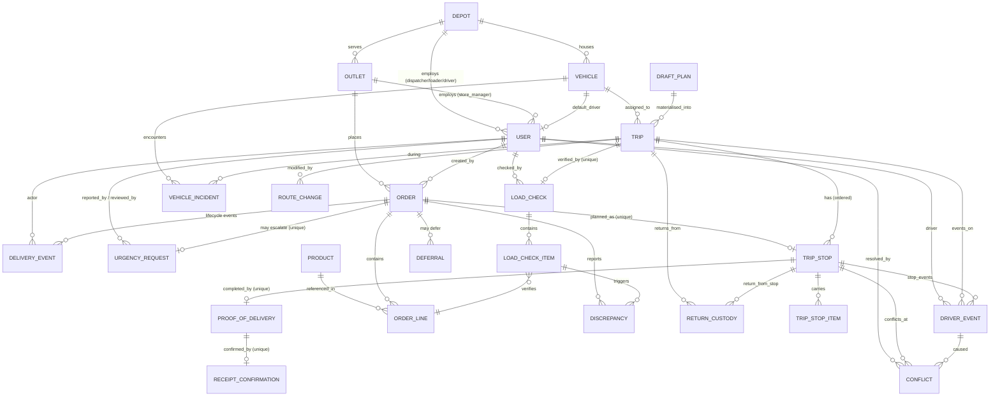
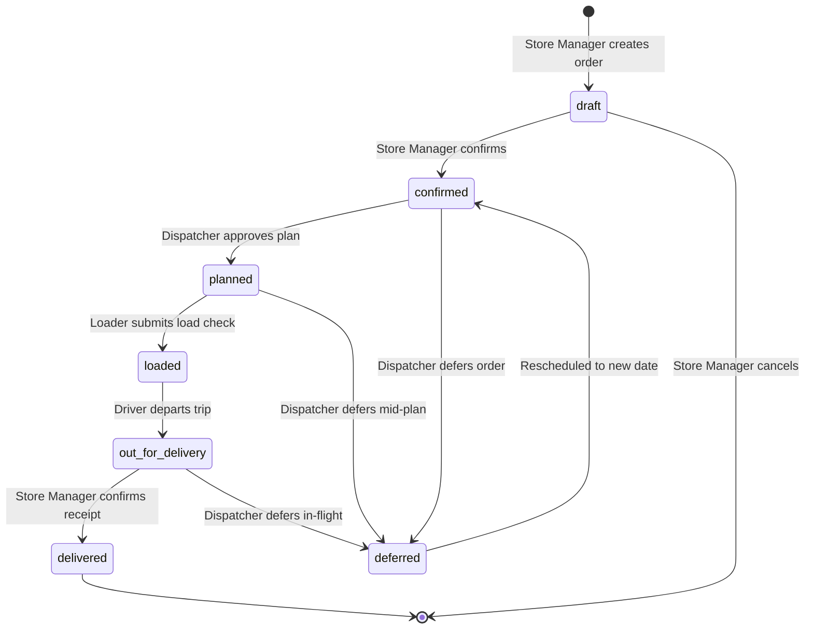
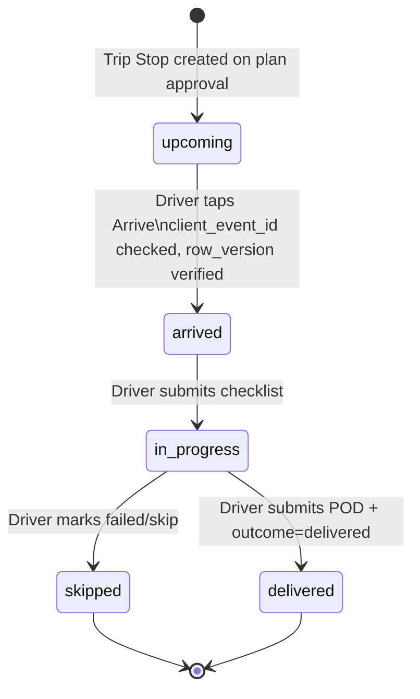

# Waypoint — Data Model

> This document describes how Waypoint stores and connects its data. Every table here corresponds directly to a SQLAlchemy model in `apps/backend/app/models/`. The schema is enforced by Alembic migrations.

---

## 1. Full Entity-Relationship Diagram



---

## 2. Table-by-Table Reference

### 2.1 Reference / Master Data

These tables are seeded once and treated as read-only during operations.

---

#### `depot`

The physical distribution hubs. All fleet and staff belong to a depot.

| Column | Type | Notes |
|---|---|---|
| `depot_id` | TEXT PK | `'peliyagoda'`, `'kandy'` |
| `name` | TEXT | Human-readable name |
| `lat` | NUMERIC | GPS latitude |
| `lng` | NUMERIC | GPS longitude |

---

#### `outlet`

The retail stores that place orders. Seeded from `outlets.csv` (120 outlets in the canonical dataset). Every outlet belongs to exactly one depot and one brand.

| Column | Type | Notes |
|---|---|---|
| `outlet_id` | TEXT PK | `'OUT001'` – `'OUT120'` |
| `name` | TEXT | Store name |
| `brand` | TEXT | `fresh` \| `style` \| `tech` |
| `district` | TEXT | Geographic district |
| `depot_id` | TEXT FK → `depot` | Serving depot |
| `lat`, `lng` | NUMERIC | Store GPS coordinates |
| `window_open`, `window_close` | TEXT | Delivery time window (`HH:MM`) |
| `mall_window` | TEXT | Mall-specific delivery window (nullable) |
| `dock_type` | TEXT | `rear_dock` \| `street` \| `mall_bay` |
| `park_constraint` | TEXT | `normal` \| `van_only` \| `mall_dock` |

**Constraints:** `park_constraint = van_only` → optimizer never assigns a truck. `park_constraint = mall_dock` → enforces mall time windows and size rules.

---

#### `vehicle`

Fleet inventory. Seeded from `vehicles.csv` (up to 60 vehicles). Live location is updated by the driver app.

| Column | Type | Notes |
|---|---|---|
| `vehicle_id` | TEXT PK | `'VEH001'` – `'VEH060'` |
| `depot_id` | TEXT FK → `depot` | Home depot |
| `driver_id` | TEXT FK → `user` | Default assigned driver (nullable) |
| `type` | TEXT | `truck` \| `van` |
| `temp` | TEXT | `reefer` \| `ambient` |
| `weight_cap_kg` | NUMERIC | Max payload in kg |
| `vol_cap_m3` | NUMERIC | Max payload volume in m³ |
| `fuel_type` | TEXT | `diesel` \| `petrol` \| `electric` |
| `km_per_l` | NUMERIC | Fuel efficiency |
| `fuel_quota_l` | INTEGER | Weekly fuel quota in litres |
| `plate` | TEXT | Licence plate |
| `status` | TEXT | `available` \| `in_workshop` |
| `last_lat`, `last_lng` | NUMERIC | Last known GPS (updated by driver) |
| `last_seen_at` | TIMESTAMPTZ | Timestamp of last location ping |

---

#### `product`

The product catalog. Seeded once per brand.

| Column | Type | Notes |
|---|---|---|
| `product_id` | TEXT PK | e.g. `'PROD-F-CHILLED'` |
| `name` | TEXT | Product name |
| `brand` | TEXT | `fresh` \| `style` \| `tech` |
| `category` | TEXT | e.g. `'Dairy'`, `'Apparel'` |
| `temp_req` | TEXT | `ambient` \| `chilled` |
| `unit` | TEXT | Unit of measure (bottle, bag, box…) |
| `unit_wt_kg` | NUMERIC | Weight per unit |
| `unit_vol_m3` | NUMERIC | Volume per unit |
| `active` | BOOLEAN | Soft-delete flag |

---

#### `user`

All operational staff. DB-level CHECK constraints enforce that store managers are linked to an outlet, while dispatchers, loaders, and drivers are linked to a depot.

| Column | Type | Notes |
|---|---|---|
| `user_id` | TEXT PK | e.g. `'USR-SM'`, `'USR-DISP'` |
| `username` | TEXT UNIQUE | Login email handle |
| `role` | TEXT | `store_manager` \| `dispatcher` \| `loader` \| `driver` |
| `outlet_id` | TEXT FK → `outlet` | Set only for `store_manager`; NULL otherwise |
| `depot_id` | TEXT FK → `depot` | Set for `dispatcher`, `loader`, `driver`; NULL for `store_manager` |
| `name` | TEXT | Display name |
| `phone` | TEXT | Contact number |
| `hashed_pw` | TEXT | BCrypt password hash |

**Integrity rule (enforced by CHECK constraint):**
- `store_manager` → `outlet_id IS NOT NULL AND depot_id IS NULL`
- `dispatcher` / `loader` / `driver` → `depot_id IS NOT NULL AND outlet_id IS NULL`

---

### 2.2 Order Domain

---

#### `order`

The wholesale purchase request from an outlet. Tracks the full lifecycle from draft through to delivered.

| Column | Type | Notes |
|---|---|---|
| `order_id` | TEXT PK | |
| `outlet_id` | TEXT FK → `outlet` | Ordering outlet |
| `created_by` | TEXT FK → `user` | Store manager who placed it |
| `brand` | TEXT | `fresh` \| `style` \| `tech` |
| `temp_req` | TEXT | `ambient` \| `chilled` |
| `order_date` | DATE | Target delivery date |
| `status` | TEXT | `draft` → `confirmed` → `planned` → `loaded` → `out_for_delivery` → `delivered` \| `deferred` |
| `order_units` | INTEGER | Total units across all lines |
| `order_wt_kg` | NUMERIC | Total weight |
| `order_vol_m3` | NUMERIC | Total volume |
| `trip_id` | TEXT FK → `trip` | Set when order is planned (nullable) |
| `submitted_at` | TIMESTAMPTZ | When order was confirmed |
| `cutoff_at` | TIMESTAMPTZ | 14:00 LKT cutoff for the delivery date |

**Unique constraint:** `UNIQUE(outlet_id, order_date, temp_req)` — one ambient and one chilled order per outlet per delivery date maximum.

---

#### `order_line`

Individual product lines within an order.

| Column | Type | Notes |
|---|---|---|
| `line_item_id` | TEXT PK | e.g. `'ORD-001-L0'` |
| `order_id` | TEXT FK → `order` | Parent order |
| `product_id` | TEXT FK → `product` | |
| `quantity` | NUMERIC | Ordered quantity |

`line_item_id` is the key used across `trip_stop_item` and `load_check_item` to maintain a consistent item identity across the entire lifecycle (prevents confusion when the same product appears in multiple lines).

---

### 2.3 Planning Domain

---

#### `draft_plan`

An optimizer-generated delivery plan before it is approved and materialised into trips. Stores the full plan JSON blob.

| Column | Type | Notes |
|---|---|---|
| `plan_id` | TEXT PK | UUID |
| `depot_id` | TEXT | Owning depot |
| `target_date` | DATE | Delivery date this plan covers |
| `status` | TEXT | `draft` \| `approved` \| `rejected` |
| `algorithm` | TEXT | Optimizer variant used |
| `plan_data` | JSON | Full proposed plan (vehicles, routes, stops, metrics) |
| `created_at` | TIMESTAMPTZ | |
| `created_by` | TEXT | Dispatcher who triggered it |
| `approved_by` | TEXT | Dispatcher who approved it |
| `approved_at` | TIMESTAMPTZ | |

**Lifecycle:** When a dispatcher approves a plan, `approve_draft_plan_operation` reads `plan_data` and materialises `trip`, `trip_stop`, and `trip_stop_item` rows in the database, then sets `status = 'approved'`.

---

#### `deferral`

Records when a dispatcher defers an order to a later date.

| Column | Type | Notes |
|---|---|---|
| `deferral_id` | TEXT PK | |
| `order_id` | TEXT FK → `order` | |
| `outlet_id` | TEXT FK → `outlet` | |
| `original_date` | DATE | The date the order was originally for |
| `new_date` | DATE | Rescheduled delivery date (nullable if open-ended) |
| `reason` | TEXT | Dispatcher's deferral reason |
| `created_at` | TIMESTAMPTZ | |
| `created_by` | TEXT FK → `user` | Dispatcher |
| `trip_id` | TEXT FK → `trip` | If deferred mid-trip |
| `client_op_id` | TEXT UNIQUE | Idempotency key |

---

### 2.4 Trip Domain

---

#### `trip`

A formal execution contract tying a vehicle, driver, and set of stops together for a specific date and brand. Generated from an approved draft plan.

| Column | Type | Notes |
|---|---|---|
| `trip_id` | TEXT PK | |
| `depot_id` | TEXT FK → `depot` | |
| `vehicle_id` | TEXT FK → `vehicle` | |
| `driver_id` | TEXT FK → `user` | Assigned driver |
| `dispatcher_id` | TEXT FK → `user` | Approving dispatcher |
| `trip_date` | DATE | Execution date |
| `trip_no` | INTEGER | `1` (morning) or `2` (afternoon) — one vehicle can do at most 2 trips per day |
| `brand` | TEXT | `fresh` \| `style` \| `tech` |
| `status` | TEXT | `planned` → `loaded` → `out_for_delivery` → `completed` |
| `plan_depart`, `plan_return` | TEXT | Planned departure / return times |
| `dist_km`, `est_fuel_l` | NUMERIC | Optimizer estimates |
| `actual_depart`, `actual_return` | TIMESTAMPTZ | Written by driver |
| `actual_dist_km`, `actual_fuel_l` | NUMERIC | Written by driver |

**Unique constraint:** `UNIQUE(vehicle_id, trip_date, trip_no)` — a vehicle cannot be assigned twice on the same date and trip number.

---

#### `trip_stop`

One delivery stop on a trip. Linked 1-to-1 with an order (no order splitting). The `row_version` field drives optimistic concurrency for offline driver sync.

| Column | Type | Notes |
|---|---|---|
| `stop_id` | TEXT PK | |
| `trip_id` | TEXT FK → `trip` | |
| `outlet_id` | TEXT FK → `outlet` | Delivery destination |
| `order_id` | TEXT FK → `order` UNIQUE | One stop per order, one order per stop |
| `stop_seq` | INTEGER | Sequence position in the route |
| `pack_seq` | INTEGER | Load packing sequence (nullable) |
| `eta` | TEXT | Planned arrival time (HH:MM) |
| `wt_kg`, `vol_m3` | NUMERIC | Stop weight and volume |
| `temp_req` | TEXT | `ambient` \| `chilled` |
| `forced_reefer` | BOOLEAN | True if ambient goods are loaded in a reefer vehicle |
| `status` | TEXT | `upcoming` → `arrived` → `delivered` \| `skipped` |
| `row_version` | INTEGER | Monotonic version for optimistic concurrency (starts at 1) |
| `arrived_at` | TIMESTAMPTZ | Written by driver on arrival |
| `arrival_lat`, `arrival_lng` | NUMERIC | Driver GPS on arrival |
| `completed_at` | TIMESTAMPTZ | Written by driver on completion |
| `skip_reason` | TEXT | Reason if stop was skipped |

**Concurrency rule:** Every driver write to a stop must supply `base_row_version == stop.row_version`. On match, the write is applied and `row_version += 1`. On mismatch, a `conflict` record is created.

---

#### `trip_stop_item`

The individual product quantities assigned to a stop. Joins `trip_stop` to `order_line` and tracks qty through loading and delivery.

| Column | Type | Notes |
|---|---|---|
| `item_id` | TEXT PK | |
| `stop_id` | TEXT FK → `trip_stop` | |
| `line_item_id` | TEXT FK → `order_line` | Links to the specific order line |
| `qty_assigned` | NUMERIC | Planned by optimizer |
| `qty_loaded` | NUMERIC | Verified by loader |
| `qty_delivered` | NUMERIC | Confirmed by driver |
| `qty_returned` | NUMERIC | Returned (partial delivery) |
| `unit` | TEXT | Unit of measure |
| `sku`, `handling_note` | TEXT | Optional metadata |

---

### 2.5 Loader Domain

---

#### `load_check`

One load check per trip. Created when the loader starts loading (`status = 'ok'` or `'shortfall'` after finalisation).

| Column | Type | Notes |
|---|---|---|
| `check_id` | TEXT PK | |
| `trip_id` | TEXT FK → `trip` UNIQUE | One check per trip |
| `checked_by` | TEXT FK → `user` | Loader |
| `checked_at` | TIMESTAMPTZ | |
| `status` | TEXT | `ok` \| `shortfall` |
| `note` | TEXT | Optional summary note |
| `client_op_id` | TEXT UNIQUE | Idempotency key |

---

#### `load_check_item`

Per-line-item result within a load check.

| Column | Type | Notes |
|---|---|---|
| `chk_item_id` | TEXT PK | |
| `check_id` | TEXT FK → `load_check` | |
| `line_item_id` | TEXT FK → `order_line` | |
| `exp_qty` | INTEGER | Expected quantity |
| `loaded_qty` | INTEGER | Actual quantity loaded |
| `status` | TEXT | `ok` \| `shortfall` \| `damaged` |
| `note` | TEXT | e.g. `'2 bags missing'` |

Any `status != 'ok'` automatically triggers a `discrepancy` record.

---

### 2.6 Delivery Domain

---

#### `proof_of_delivery`

Created by the driver when they submit POD at a stop. The `otp` field is returned to the driver and must be given to the store manager to confirm receipt.

| Column | Type | Notes |
|---|---|---|
| `pod_id` | TEXT PK | |
| `stop_id` | TEXT FK → `trip_stop` UNIQUE | One POD per stop |
| `order_id` | TEXT FK → `order` | |
| `driver_id` | TEXT FK → `user` | |
| `delivered_at` | TIMESTAMPTZ | |
| `delivered_units` | INTEGER | |
| `return_units` | INTEGER | |
| `photo_url` | TEXT | Path to uploaded evidence file |
| `otp` | TEXT | One-time PIN for store manager receipt confirmation |
| `notes` | TEXT | Driver delivery notes |

---

#### `receipt_confirmation`

Created by the store manager after physically receiving the delivery. Closes the order lifecycle.

| Column | Type | Notes |
|---|---|---|
| `confirm_id` | TEXT PK | |
| `order_id` | TEXT FK → `order` UNIQUE | One confirmation per order |
| `pod_id` | TEXT FK → `proof_of_delivery` | |
| `confirmed_by` | TEXT FK → `user` | Store manager |
| `confirmed_at` | TIMESTAMPTZ | |
| `received_units` | INTEGER | Physically counted on receipt |
| `notes` | TEXT | |
| `client_op_id` | TEXT UNIQUE | Idempotency key |

---

#### `discrepancy`

Any mismatch between what was expected and what was physically present — created at loading (shortfall) or at receipt (missing, damaged, wrong item, short qty).

| Column | Type | Notes |
|---|---|---|
| `discrepancy_id` | TEXT PK | |
| `order_id` | TEXT FK → `order` | |
| `raised_by` | TEXT FK → `user` | Loader or store manager |
| `source_stage` | TEXT | `loading` \| `receipt` |
| `chk_item_id` | TEXT FK → `load_check_item` | Set if raised at loading stage |
| `product_id` | TEXT FK → `product` | |
| `type` | TEXT | `missing` \| `damaged` \| `wrong_item` \| `short_qty` \| `other` |
| `reported_qty` | NUMERIC | Discrepant quantity |
| `status` | TEXT | `open` \| `resolved` |
| `note` | TEXT | |

---

#### `return_custody`

Tracks goods that couldn't be delivered and are being returned to the depot with chain-of-custody.

| Column | Type | Notes |
|---|---|---|
| `return_id` | TEXT PK | |
| `trip_id` | TEXT FK → `trip` | |
| `stop_id` | TEXT FK → `trip_stop` | |
| `driver_id` | TEXT FK → `user` | Driver carrying the return |
| `items` | TEXT (JSON) | `[{item_id, line_item_id, product_id, qty}]` |
| `reason` | TEXT | Why goods are being returned |
| `return_crate` | TEXT | Crate ID if using return crate |
| `status` | TEXT | `pending` \| `confirmed` |
| `created_at` | TIMESTAMPTZ | |
| `created_event_id` | TEXT FK → `driver_events` | Originating driver event |
| `confirmed_at` | TIMESTAMPTZ | When accepted at depot |
| `confirmed_event_id` | TEXT FK → `driver_events` | Depot confirmation event |
| `officer_name` | TEXT | Depot officer who accepted |
| `condition` | TEXT | Physical condition note |

---

### 2.7 Event Ledger (Append-Only)

These tables are **never updated after insert**. They are the canonical source of truth for all state changes.

---

#### `delivery_events`

Coarse lifecycle events for orders, visible to all roles. One row per status transition of an order.

| Column | Type | Notes |
|---|---|---|
| `event_id` | TEXT PK | |
| `order_id` | TEXT FK → `order` | |
| `event_type` | TEXT | `order_confirmed` \| `order_planned` \| `order_loaded` \| `order_out_for_delivery` \| `order_delivered` \| `order_deferred` |
| `actor_id` | TEXT FK → `user` | Who triggered the event |
| `actor_role` | TEXT | Role at time of event |
| `occurred_at` | TIMESTAMPTZ | |
| `offline` | BOOLEAN | True if event was queued while offline |
| `synced_at` | TIMESTAMPTZ | When offline event was synced |
| `client_op_id` | TEXT UNIQUE | Idempotency key |

---

#### `driver_events`

Fine-grained append-only ledger of every action a driver takes. This is **the source of truth** for stop states. The `row_version` fields record the before/after state for conflict auditing.

| Column | Type | Notes |
|---|---|---|
| `event_id` | TEXT PK | Server-generated UUID |
| `driver_id` | TEXT FK → `user` | |
| `device_id` | TEXT | Device identifier (for offline tracking) |
| `client_event_id` | TEXT UNIQUE | Client-generated UUID — **idempotency key** |
| `kind` | TEXT | Event type (e.g. `stop.arrived`, `pod.submitted`, `trip.departed`) |
| `stop_id` | TEXT FK → `trip_stop` | Applicable stop (nullable for trip-level events) |
| `trip_id` | TEXT FK → `trip` | |
| `payload` | TEXT (JSON) | Full event payload |
| `occurred_at` | TIMESTAMPTZ | Client timestamp (when it happened on device) |
| `received_at` | TIMESTAMPTZ | Server timestamp (when we received it) |
| `applied_at` | TIMESTAMPTZ | When the side-effect was applied |
| `status` | TEXT | `pending` \| `applied` \| `conflict` \| `failed` \| `already_applied` |
| `row_version_before` | INTEGER | Stop's `row_version` before this event |
| `row_version_after` | INTEGER | Stop's `row_version` after this event |
| `error` | TEXT | Error message if `status = 'failed'` |

**Key pattern:** If `client_event_id` already exists in this table → return `already_applied` without inserting. This makes offline retries safe.

---

#### `conflict`

Created when a driver event's `base_row_version` does not match the current `trip_stop.row_version`. Represents a concurrent-edit conflict that must be reviewed by a dispatcher.

| Column | Type | Notes |
|---|---|---|
| `conflict_id` | TEXT PK | |
| `stop_id` | TEXT FK → `trip_stop` | Conflicted stop |
| `driver_event_id` | TEXT FK → `driver_events` | The event that caused the conflict |
| `driver_json` | TEXT (JSON) | Driver's view of the state |
| `system_json` | TEXT (JSON) | Server's view of the state |
| `status` | TEXT | `in_review` \| `forwarded` \| `resolved` \| `dismissed` |
| `created_at` | TIMESTAMPTZ | |
| `forwarded_at` | TIMESTAMPTZ | When driver forwarded it |
| `resolved_at` | TIMESTAMPTZ | |
| `resolved_by` | TEXT FK → `user` | Dispatcher who resolved it |
| `resolved_by_role` | TEXT | |
| `resolution` | TEXT | `accept_driver` \| `keep_server` \| `dismiss` |
| `resolution_note` | TEXT | |

**Rule:** Drivers can **forward** a conflict but cannot resolve it. Only a dispatcher can resolve via `POST /driver-platform/conflicts/{id}/resolve`.

---

### 2.8 Operational Events

---

#### `vehicle_incident`

Reported by a driver when a vehicle breaks down or has a pre-trip failure.

| Column | Type | Notes |
|---|---|---|
| `incident_id` | TEXT PK | |
| `vehicle_id` | TEXT FK → `vehicle` | |
| `trip_id` | TEXT FK → `trip` | Trip in progress when incident occurred |
| `type` | TEXT | `breakdown` \| `pre_trip_failure` \| `reefer_failure` \| `other` |
| `detail` | TEXT | Free-text description |
| `reported_by` | TEXT FK → `user` | |
| `reported_at` | TIMESTAMPTZ | |
| `resolved_at` | TIMESTAMPTZ | Set after recovery plan is approved |

---

#### `route_change`

A dispatcher-issued instruction to modify an active trip's route. Polled by the driver app via `GET /driver-platform/changes`.

| Column | Type | Notes |
|---|---|---|
| `change_id` | TEXT PK | |
| `trip_id` | TEXT FK → `trip` | |
| `change_type` | TEXT | e.g. `route.resequenced`, `stop.added`, `stop.removed` |
| `payload` | TEXT (JSON) | Full change details (new sequence, stop IDs, etc.) |
| `issued_at` | TIMESTAMPTZ | |
| `issued_by` | TEXT FK → `user` | Dispatcher |
| `acknowledged` | BOOLEAN | True once driver has acked |
| `ack_at` | TIMESTAMPTZ | |

---

#### `urgency_request`

A store manager's escalation for an order that needs priority attention. One-to-one with an order.

| Column | Type | Notes |
|---|---|---|
| `urgency_request_id` | TEXT PK | |
| `order_id` | TEXT FK → `order` UNIQUE | One per order |
| `outlet_id` | TEXT FK → `outlet` | |
| `reported_by` | TEXT FK → `user` | Store manager |
| `reason_code` | TEXT | `stockout_risk` \| `store_operation_impact` \| `chilled_shortage` \| `time_bound_event` \| `recovery_after_failed_delivery` \| `other` |
| `reason_text` | TEXT | Free-text explanation |
| `status` | TEXT | `pending` → `approved` \| `rejected` → `resolved` |
| `reviewed_by` | TEXT FK → `user` | Dispatcher who reviewed |
| `reviewed_at` | TIMESTAMPTZ | |
| `decision_note` | TEXT | Dispatcher's decision rationale |
| `created_at` | TIMESTAMPTZ | |
| `resolved_at` | TIMESTAMPTZ | |
| `client_op_id` | TEXT UNIQUE | Idempotency key |

---

## 3. Order Lifecycle State Machine



---

## 4. Driver Stop Lifecycle & Concurrency



Every transition writes a `driver_event` row first (idempotency check on `client_event_id`), then updates `trip_stop.status` and increments `trip_stop.row_version`. If the `base_row_version` provided by the driver doesn't match the stored version, a `conflict` row is created instead and no state change is applied.

---

## 5. Key Integrity Rules

| Rule | Enforced By |
|---|---|
| One ambient + one chilled order per outlet per date | `UNIQUE(outlet_id, order_date, temp_req)` on `order` |
| One load check per trip | `UNIQUE(trip_id)` on `load_check` |
| One stop per order (no splitting) | `UNIQUE(order_id)` on `trip_stop` |
| One POD per stop | `UNIQUE(stop_id)` on `proof_of_delivery` |
| One receipt confirmation per order | `UNIQUE(order_id)` on `receipt_confirmation` |
| One urgency request per order | `UNIQUE(order_id)` on `urgency_request` |
| A vehicle makes at most 2 trips per day | `UNIQUE(vehicle_id, trip_date, trip_no)` on `trip` |
| Offline driver event deduplication | `UNIQUE(client_event_id)` on `driver_events` |
| Operational idempotency | `UNIQUE(client_op_id)` on `load_check`, `deferral`, `receipt_confirmation`, `urgency_request`, `delivery_events` |
| Store managers are never linked to a depot | DB CHECK constraint on `user` |
| Dispatchers/loaders/drivers are never linked to an outlet | DB CHECK constraint on `user` |
| Chilled goods require reefer vehicles | Enforced by optimizer constraint validator, not DB |
| Van-only outlets never receive trucks | Enforced by optimizer constraint validator, not DB |

---

## 6. Idempotency Pattern

Every write operation that can be retried (order confirmation, load check, driver events, receipt, urgency) carries a client-generated `client_op_id` or `client_event_id`. The server checks for this key before applying any side effects:

```
if key already exists in table:
    return existing result (already_applied)
else:
    apply mutation
    insert key
    return result
```

This makes all driver operations — including batched offline sync — safe to retry without creating duplicate records or double-advancing state machines.
