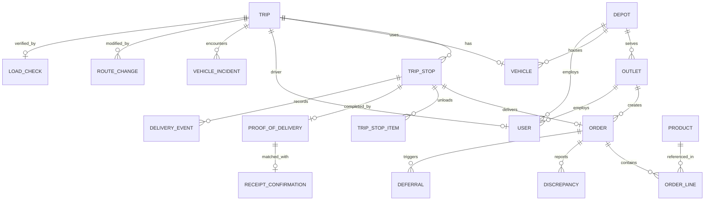

# Data Model & ER Diagram

> **Note:** The definitive canonical schema contract is defined in `docs/schema_design.md` and enforced by Alembic migrations in the backend. This document serves as a human-readable architecture/ER explanation of the current implemented system.

## Entity Relationship Diagram (ERD)

## Data Dictionary

### User
- **Purpose:** Identifies operational staff and their RBAC role.
- **Constraints:** Enforces rule where Store Managers must have an `outlet_id` but no `depot_id`, while Dispatchers, Loaders, and Drivers must have a `depot_id` and no `outlet_id`.

### Depot & Outlet
- **Purpose:** Represent physical locations.
- **Outlet Constraints:** Enforces `brand` ('fresh', 'style', 'tech'), `dock_type` ('rear_dock', 'street', 'mall_bay'), and `park_constraint` ('normal', 'van_only', 'mall_dock'). These natively inform the Optimizer.

### Vehicle
- **Purpose:** Represents fleet inventory.
- **Constraints:** Captures `temp` (reefer/ambient), `type` (truck/van), physical capabilities (`weight_cap_kg`, `vol_cap_m3`), and fuel constraints.

### Order & OrderLine
- **Purpose:** The wholesale request originating from an Outlet.
- **Key Relationships:** Associated rigidly with an `Outlet`. Denormalizes aggregate required capabilities.

### Trip & TripStop
- **Purpose:** Formal execution contract generated from the Optimizer's DraftPlan.
- **Relationships:** A `Trip` ties together a `Vehicle` and a sequential array of `TripStops`. A `TripStop` exclusively completes a single `Order`.
- **State Machine (Trip):** `planned` -> `loaded` -> `out_for_delivery` -> `completed`
- **State Machine (TripStop):** `upcoming` -> `arrived` -> `delivered` / `skipped`

### Operational Guardrails
- **LoadCheck:** The Loader asserts exactly what is packed compared against the TripStopItem expectation. Shortfalls log discrepancies instantly.
- **DeliveryEvent:** Immutable ledger mapping the Driver's real-world actions, designed explicitly for idempotent offline syncing.
- **VehicleIncident & RouteChange:** Allows a driver to post a breakdown, which produces an incident record. The Optimizer consumes the incident and generates rescue instructions (`RouteChange`).
- **UrgencyRequest:** Used by Store Managers to flag critical orders. Can bump Optimizer scoring algorithms.

## Business Integrity Rules Enforced
1. **Capacity Validations:** Vehicle cubic volume and weight are strictly respected by the optimizer when building trips.
2. **Temperature Matching:** Chilled products unconditionally require reefer-capable vehicles.
3. **Vehicle Constraints:** Van-only outlets cannot be assigned trucks. Mall docks restrict truck sizes.
4. **Offline Resilience:** The Driver application's Event-Ledger model guarantees that connectivity drops will not duplicate drops, and timestamps manage concurrency overrides accurately.
5. **No Order Splitting:** An Order must be serviced in full within a single TripStop. Partial fulfillments generate exceptions during Load Check.
