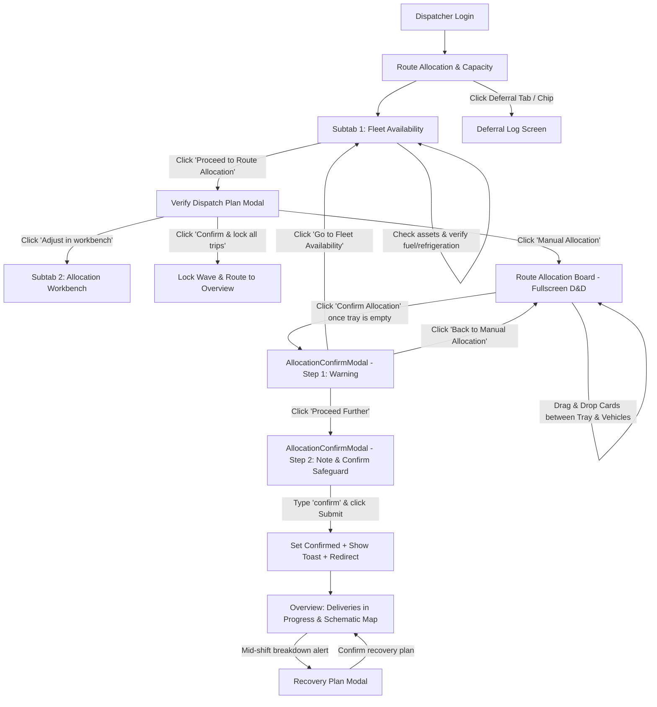

# Waypoint Dispatcher Portal — Comprehensive Workflow & State Specification

> **Target Audience**: AI Prompt Engineers, Principal UI/UX Designers, Frontend Architects  
> **Purpose**: End-to-end technical and UX specification of the Dispatcher Portal for feeding into LLMs (such as Claude 3.5 Sonnet / Opus) to optimize, redesign, or extend components while preserving operational logic, state machines, and design systems.

---

## 1. System Architecture & High-Level Overview

The **Waypoint Dispatcher Portal** is an industrial B2B logistics control tower designed for depot dispatchers managing high-throughput grocery and retail delivery operations across hubs in Sri Lanka (e.g., Peliyagoda, Kandy, Galle). It handles cold-chain (Reefer) and dry-goods (Ambient) fulfillment under tight time-window and vehicle-capacity constraints.

### Core Portals & Personas
- **Dispatcher Portal** (This system): Evaluates fleet availability, audits automated CP-SAT optimization solver plans, executes manual route drag-and-drop overrides, locks dispatch waves, and monitors live in-transit deliveries.
- **Upstream / Connected Actors**: 
  - *Drivers* (report pre-trip inspection failures, breakdown locks).
  - *Loaders* (receive bay staging manifests once waves are confirmed).
  - *Store Managers* (receive automated notifications of incoming waves or deferred orders).

---

## 2. Complete State Machine & Variable Catalog

The portal is driven by a single-page state engine (implemented in `DispatcherRoster.jsx` and `RouteAllocationBoard.jsx`). The state variables, their types, and roles are documented below:

| State Variable | Type | Allowed Values / Default | Scope / Location | Purpose |
|---|---|---|---|---|
| `activeNav` | `string` | `'Overview'` \| `'Route Allocation & Capacity'` \| `'Contingency Dispatch'` \| `'Deferral Log'` (Default: `'Overview'`) | Global (`DispatcherRoster`) | Top-level navigation bar tab selector. |
| `activeSubTab` | `string` | `'Fleet Availability'` \| `'Allocation Workbench'` (Default: `'Fleet Availability'`) | `Route Allocation & Capacity` Tab | Secondary sub-tab switcher within route planning. |
| `selectedHub` | `string` | `'Peliyagoda'` \| `'Kandy'` (Default: `'Peliyagoda'`) | Roster / Workbench | Switches current depot scope. |
| `categoryFilter` | `string` | `'all'` \| `'reefer'` \| `'van'` (Default: `'all'`) | Fleet Availability Subtab | Filters asset table by powertrain/refrigeration. |
| `searchQuery` | `string` | `string` (Default: `''`) | Fleet Availability Subtab | Text filter for vehicle IDs and models. |
| `selectedRowId` | `string` | `string` \| `null` (Default: `'VEH004'`) | Fleet Availability Subtab | Currently highlighted vehicle row. |
| `showDispatchPlanModal` | `boolean` | `true` \| `false` (Default: `false`) | Global Overlay | Toggles the **Verify Dispatch Plan Modal** (CP-SAT solver review). |
| `showAllocationBoard` | `boolean` | `true` \| `false` (Default: `false`) | Screen Override | When `true`, replaces standard layout with full-screen **Route Allocation Board**. |
| `isAllocationConfirmed` | `boolean` | `true` \| `false` (Default: `true`) | Global Workflow State | Tracks whether the current wave has been locked and confirmed. |
| `showConfirmToast` | `boolean` | `true` \| `false` (Default: `false`) | Global Feedback | Displays transient green top toast upon plan lock. |
| `hoveredUnavailableVehicle`| `object` \| `null` | Vehicle object or `null` | Fleet Availability Table | Holds data for floating wireframe popover on locked vehicles. |
| `mousePos` | `{x, y}` | `{ x: 0, y: 0 }` | Fleet Availability Table | Tracks cursor for floating popover positioning. |
| `workbenchView` | `string` | `'vehicle'` \| `'outlet'` \| `'deferrals'` (Default: `'vehicle'`) | Allocation Workbench Subtab | Switches layout between Vehicle manifests, Outlet stops, or Deferral queues. |
| `workbenchFilter` | `string` | `'all'` \| `'reefers'` \| `'delayed'` (Default: `'all'`) | Allocation Workbench Subtab | Filters proposed assignment cards. |
| `expandedVehicleIds` | `Set<string>` | Set of vehicle IDs (Default: `Set(['VEH014'])`) | Allocation Workbench | Tracks accordion expanded/collapsed state for vehicles. |
| `expandedStopIds` | `Set<string>` | Set of stop IDs (Default: `Set(['VEH014-OUT-4089'])`) | Allocation Workbench | Tracks item manifest disclosure inside a vehicle stop. |
| `expandedOutletIds` | `Set<string>` | Set of outlet IDs (Default: `Set(['OUT-4089'])`) | Allocation Workbench | Tracks vehicle assignment accordion in Outlet view. |
| `showRecoveryModal` | `boolean` | `true` \| `false` (Default: `false`) | Overview / Workbench | Toggles the **Recovery Plan Modal** for mid-shift breakdowns. |
| `recoveryDeployed` | `boolean` | `true` \| `false` (Default: `false`) | Overview Tab | Flags whether mid-shift recovery v2 is active. |
| `overviewDepot` | `string` | `'Peliyagoda Depot'` \| `'Kandy Regional Hub'` \| `'Galle Hub'` | Overview Tab | Depot selector for live tracking. |
| `overviewFilterTab` | `string` | `'all'` \| `'outlet'` \| `'delayed'` \| `'offline'` \| `'completed'` | Overview Tab | Filters live runs table. |
| `selectedMapVehicle` | `string` | `string` (Default: `'VEH014'`) | Overview Tab | Highlights vehicle on schematic map and syncs with table. |
| `rows` | `Array<Row>` | Initial array of 5 vehicles | `RouteAllocationBoard` | Current board state with assigned product cards. |
| `tray` | `Array<Card>`| Initial array of 5 unassigned cards | `RouteAllocationBoard` | Unassigned line items parked in the bottom tray. |
| `sortBy` | `string` | `'vehicleId'` \| `'fuel'` \| `'type'` \| `'fill'` | `RouteAllocationBoard` | Sorts vehicle lanes. |
| `trayFilter` | `string` | `'all'` \| `'Waypoint Fresh'` \| `'Waypoint Style'` \| `'Waypoint Tech'` | `RouteAllocationBoard` | Brand filter for unassigned tray. |
| `dragCard` | `object` \| `null`| `{ card, sourceType, sourceVehicleId }` | `RouteAllocationBoard` | Currently dragged card payload. |
| `showConfirmModal` | `boolean` | `true` \| `false` (Default: `false`) | `RouteAllocationBoard` | Toggles the two-step manual override confirmation modal. |

---

## 3. End-to-End Workflow Lifecycles



---

## 4. Deep Dive: Screen & Subtab Specifications

### 4.1 Subtab 1: Fleet Availability (`Route Allocation & Capacity`)
- **Primary Goal**: Audit depot vehicle roster before dispatch wave generation. Verify fuel quotas, temperature capabilities, and driver pre-trip exclusions.
- **Layout & Visual Elements**:
  - **Depot Hub Switcher**: Pill buttons for `Peliyagoda Hub (42)` and `Kandy Hub (18)`.
  - **Category Filters**: `All Vehicles`, `Reefers Only`, `Vans Only`.
  - **Search Bar**: Real-time filtering by vehicle identifier or spec.
  - **Summary Metric Strip**:
    - `X / Y Vehicles Active` badge (`#EAF6EE` background, `#059669` text).
    - `Z Reefers Ready` badge.
    - `Total Volume: X.X m³` and `Total Weight: X,XXX kg`.
  - **CTA Button**: `[Proceed to Route Allocation →]` (Triggers `VerifyDispatchPlanModal`).
  - **Fleet Table**:
    - **Columns**: Master Checkbox, Vehicle ID, Depot, Type (Truck/Van), Refrigeration (Reefer/Ambient), Max Payload (kg), Max Volume (m³), Weekly Fuel Quota (progress bar + %), Roster Status.
    - **Interactive Master Checkbox**: Three states: All Checked, Partially Checked (indeterminate style), None Checked.
    - **Unavailable Vehicle Rows**: 
      - Checkbox is disabled with a lock icon.
      - Status pill: `Excluded from Run` (`#FFF1F2` background, `#BE123C` text).
      - **Hover Popover Tooltip**: Hovering over an unavailable vehicle row renders a lightweight wireframe tooltip positioned dynamically near cursor (`mousePos`):
        - Header: Vehicle ID + "Unavailable" + Source Tag (`Driver Portal` or `Maintenance`).
        - Issue Statement: e.g., *"Brake hydraulic pressure anomaly detected during pre-trip inspection."*
        - Meta: Reported By (`K. Gunawardena`), Estimated Return (`Today, 4:30 PM`), Action (`Brake Fluid Bleed & Pressure Test`).

---

### 4.2 Modal: Verify Dispatch Plan Modal (`VerifyDispatchPlanModal.jsx`)
- **Primary Goal**: Surface the CP-SAT optimization engine's automated solution, calling out deferred orders and priority placements.
- **Initial Loading State (Vercel Geist Elements)**:
  - When the modal opens, it displays a **3-second computing state** (`isLoading = true` for 3000ms):
    - **Geist Spinner (Green Theme)**: 12-segment radiating bar spinner in primary green (`#059669`) inside a light surface container (`#EBF6F0` with border `#DCF0E5`).
    - **Status Message**: Minimal heading: *"Calculating routes..."* in brand text (`#0B2019`).
- **Post-Computation Presentation** (`isLoading = false`):
  - **Header**: "Verify the dispatch plan" · Hub and order cut-off timestamp (`Peliyagoda Hub · deliveries for Fri, Oct 2 · 31 orders closed at 4:00 PM`).
  - **Side-by-Side Summary Cards**:
    - **Placed Card**: Light green (`#EDF7F1`, border `#D1F2DD`) with `"28 of 31 orders"` and subtext `"21 vehicles · 30 trips"`.
    - **Deferred Card**: Peach/sand (`#FEF5EE`, border `#FDE4D0`) with `"3 chilled orders"` and subtext `"Every reefer is deployed"`.
  - **Deferred Items List**: `Deferred · 3 orders · 820kg · 3.5 m³`:
    - Rows with order ID, outlet name, outlet code, item manifest, remaining fresh window time.
    - Interactive **`Assign manually →`** quick-links for `"Your call"` deferred orders, directing the dispatcher straight into the manual allocation board.
    - `"Unavoidable"` badge for physical constraints (e.g. van-only outlets needing unavailable reefer vans).
  - **Priority Outlets Strip**: Light green pill banner: `"Priority outlets (3) · skipped yesterday, placed first today"` with expandable **View all** drawer.
  - **Warning Notice Card**: Lock icon with `"This locks all 30 trips and sends loading lists and deferral notices. It can't be edited afterward."`.
  - **Footer Actions**:
    - Left text link: `Adjust in workbench` (opens the manual Route Allocation Board).
    - Right primary button: `[Confirm & lock all trips]` in primary green (`#059669`).

---

### 4.3 Screen: Route Allocation Board (`RouteAllocationBoard.jsx`)
- **Primary Goal**: Full-screen visual drag-and-drop workspace allowing dispatchers to manually slot unassigned order line-items onto vehicles and re-balance capacities.
- **Top Navigation Bar**:
  - **Top-Left Back Arrow Button**: High-affordance rounded arrow button (`<ArrowLeft size={15} />`) on the top-left before the brand title to immediately return to Fleet Availability.
  - Brand header with click-to-exit.
  - Breadcrumb: `Allocation Board · Peliyagoda Hub · Thu, Oct 1`.
  - Secondary Back Button: `[← Fleet Availability]`.
  - Primary Action Button: `[Confirm Allocation]` (disabled with tooltip when unassigned items remain; green `#059669` when tray is empty).
- **Sort Controls Bar**:
  - Sort pills: `Vehicle ID`, `Fuel Remaining`, `Type`, `Fill %`.
- **Main Board Canvas (Scrollable Vehicle Rows)**:
  - Each lane represents an active vehicle trip:
    - **Vehicle Info Card (Left Column, 208px fixed width)**:
      - Vehicle ID (e.g., `VEH014`).
      - Refrigeration Pill: Reefer (with snowflake icon) or Ambient (with wind icon).
      - Trip label: `Trip 1 of 2`.
      - Dynamic Weight Capacity Bar: Current kg vs Max kg + color transitions (`#059669` < 75%, `#F59E0B` 75-90%, `#EF4444` > 90%).
      - Dynamic Volume Capacity Bar: Estimated m³ vs Max m³.
      - Fuel Quota: Progress indicator.
    - **Product Cards & Stops Area (Right Column, horizontally scrollable)**:
      - Stops grouped by sequence: `Stop 1 · Nugegoda`, `Stop 2 · Maharagama`.
      - Dividers between stops.
      - **ProductCard Component**:
        - Order Tag: Unique background/border color hashed by `orderId`.
        - Stop metadata: `Stop X - Outlet Name`.
        - Product name (2-line clamp).
        - Quantity badge.
        - Draggable handle (HTML5 DnD).
      - **DropZone**:
        - Dashed drop target. Highlights green (`#059669` with `#EBF6F0` surface) when dragged card is temperature-compatible.
        - **Compatibility Gate**: Reefer items can *only* drop on Reefer vehicles; Ambient items can *only* drop on Ambient vehicles. Non-compatible lanes dim to 35% opacity during drag.
- **Bottom Docked Unassigned Tray (`INITIAL_TRAY`)**:
  - Docked at viewport bottom with z-index elevation.
  - Header: Counter (`Unassigned line items (X)`), category filters (`All`, `Waypoint Fresh`, `Waypoint Style`, `Waypoint Tech`), completion badge (`All items placed`).
  - Horizontal drag-and-drop shelf: Holds unassigned cards. Dragging from vehicle back to tray unassigns the card.

---

### 4.4 Modal: Two-Step Allocation Confirmation (`AllocationConfirmModal.jsx`)
- **Trigger**: Click `[Confirm Allocation]` on the Route Allocation Board.
- **Step 1: Deviation Warning & Safety Gate**:
  - Amber warning icon & title: *"You have changed the allocations"*.
  - Body: *"The manual allocation differs from the CP-SAT solver plan. Proceeding will override the optimised plan and lock the manual allocation as the active dispatch."*
  - Safety verification checklist:
    - Temperature compatibility manually verified.
    - Vehicle payload and volumetric capacities not exceeded.
    - Outlet delivery time windows remain achievable.
  - **Three Navigation Options**:
    1. `[Go to Fleet Availability]`: Cancels changes and returns to initial roster.
    2. `[Back to Manual Allocation]`: Closes modal to return to drag-and-drop board for further adjustments.
    3. `[Proceed Further]`: Transitions modal to Step 2.
- **Step 2: Audit Logging & Typed Safeguard**:
  - Title: *"Confirm manual allocation"*.
  - **Audit Note Textarea**: Optional description field for compliance history (e.g., *"VEH009 had spare chilled capacity and outlet OUT-4089 had priority medical cargo"*).
  - **Verification Safeguard Input**:
    - Requires user to explicitly type `"confirm"` into an input box.
    - The `[Confirm manual allocation]` submit button remains disabled (`#A7D7C5`, `not-allowed`) until input exactly matches `"confirm"`.
  - **Submission Execution**:
    - Closes modal.
    - Sets `isAllocationConfirmed = true`.
    - Triggers 4-second confirmation toast: *"Route allocations confirmed & locked for Wave 1!"*.
    - **Redirect**: Automatically shifts view to `activeNav = 'Overview'`, taking the dispatcher straight to the live Deliveries in Progress monitoring console.

---

### 4.5 Subtab 2: Allocation Workbench (`Route Allocation & Capacity`)
- **Primary Goal**: Hierarchical tabular inspection and micro-adjustments of vehicle manifests and outlet deliveries.
- **Sub-Views (`workbenchView`)**:
  1. `View by Vehicle`:
     - Expandable vehicle cards (`expandedVehicleIds`).
     - Shows route stops sequence, cargo weight breakdown, and stop ETA.
     - Nested stop item manifest disclosure (`expandedStopIds`).
  2. `View by Outlet`:
     - Grouped by recipient store / supermarket (`expandedOutletIds`).
     - Displays which vehicles are delivering to that specific outlet, expected arrival times, and drop-off weights.
  3. `Deferrals`:
     - Direct jump to unassigned and deferred items queue.
- **Direct Confirmation Action & State Behavior**:
  - Persistent summary strip with `[Confirm Route Allocation]` button for locking directly from the workbench.
  - The `[← Fleet Availability]` navigation button is **automatically hidden** once the route allocation has been confirmed (`!isAllocationConfirmed`), ensuring the interface reflects that the dispatch wave is locked.

---

### 4.6 Tab: Overview / Deliveries in Progress (`activeNav = 'Overview'`)
- **Primary Goal**: Real-time telematics and delivery execution monitoring after wave dispatch.
- **Top Metric Cards Bar**:
  - Depot switcher dropdown: `Peliyagoda Depot`, `Kandy Regional Hub`, `Galle Hub`.
  - Metric 1: **Fleet Utilization**: `34 / 60 Active`.
  - Metric 2: **Reefer Cold Chain**: `15 Normal - 1 Warning` (sensor temperature alerts).
  - Metric 3: **Fleet Quota**: `68% Burn`.
  - Attention Pill: Pulsing amber pill: `3 runs need attention`.
- **Depot Hub Schematic Visual Canvas**:
  - Custom SVG schematic rendering the hub, expressway corridors (A1/E02), and feeder loops.
  - Active vehicle markers with live coordinates, vehicle ID badges, and pulse animations for delayed runs.
  - Search bar to highlight specific vehicles or routes.
  - Two-way selection sync: Clicking a vehicle marker selects it in the table; clicking a table row centers and highlights the vehicle on the schematic map.
- **Live Deliveries Table**:
  - **Tabs**: `All active (34)`, `At outlet (8)`, `Delayed active (3)`, `Offline`, `Completed (26)`.
  - **Columns**: RUN / ID, VEHICLE, DESTINATION, ETA / SCHEDULED STATUS, DISPATCH RISK NOTES.
  - **Status Badges**: `In Transit` (Sky), `At Outlet` / `Unloading` (Blue), `Delayed` (Rose), `Offline` (Slate), `Completed` / `Signed Off` (Emerald).
  - **Risk Notes**: Dynamic alerts (e.g., *"Cold-chain sensor +2.4°C over threshold"*, *"A1 Highway traffic +18m"*).

---

### 4.7 Tab: Contingency Dispatch (`activeNav = 'Contingency Dispatch'`)
- **Primary Goal**: Manage mid-shift logistical emergencies caused by vehicle mechanical breakdowns, accidents, and Point-of-Delivery (POD) damaged goods rejections.
- **Top Header Bar**:
  - Hub Switcher: `Peliyagoda Hub`.
  - Real-Time Disruption Badges:
    - Pre-Recovery: `2 Vehicle Breakdowns` (Rose), `1 Damaged at POD` (Peach/Amber), `4 Orders Disrupted (1,730 kg)` (Sky).
    - Post-Recovery: `Recovery Plan v2 Active` (Emerald), `3 Recovery Trips Underway` (Sky).
  - Primary Action Button:
    - Pre-Recovery: **`[Start Recovery Plan →]`** in primary green (`#059669`).
    - Post-Recovery: `[Reset Incident Demo]` for testing.
- **State A — Pre-Recovery View (`recoveryDeployed === false`)**:
  - Red/Rose alert banner detailing disabled vehicles (e.g. `VEH011` at dock, `VEH006` on highway) and damaged shipments at receiving docks.
  - Rows styled consistently with vehicle trip manifests:
    - Identifier: Bold order ID (e.g. `ORD-30088`).
    - Incident badges: `VEH011 (Van)` and `Reefer` (`#E0F2FE` blue).
    - Incident title: Bold font (e.g. `Trip 1 of 2` or `Hydraulic Lock`).
    - Cargo description: e.g. `Fresh - Chilled Chicken 390 kg`.
    - Reason Pill: Gray pill (`bg-[#EDF2F7]`) with icon (`AlertTriangle` or `Package`) reading `Vehicle Breakdown` or `Damaged Goods at POD`.
    - Destination outlet: e.g. `OUT-3012 Maharagama`.
    - Logged time: `08:15 AM - 09:45 AM`.
    - Interactive accordion chevron: Expands to reveal driver notes, staging bays, and `Re-allocate in Recovery Plan →`.
- **State B — Recovery Plan Modal (`RecoveryPlanModal.jsx`)**:
  - Triggered by clicking `[Start Recovery Plan →]`.
  - **Geist Loading State**: 2.5-second computing spinner (`GeistSpinner`) in primary green theme with *"Calculating recovery routes..."*.
  - **Two Summary Cards**:
    - *Re-slotted onto Fleet*: Light green card (`#EDF7F1`) showing `"3 of 5 orders"` re-assigned to active vehicles (`VEH014`, `VEH009`, `VEH041`).
    - *Deferred to Next Wave*: Light amber card (`#FEF5EE`) showing `"2 orders deferred"` due to fresh delivery windows expiring or cold-chain quarantine.
  - **Footer Actions**:
    - Left text link: `Adjust in workbench`.
    - Right primary button: `[Confirm & lock recovery plan]`.
- **State C — Post-Recovery View (`recoveryDeployed === true`)**:
  - Green confirmation banner: *"Recovery Plan v2 is actively executing — 3 recovered orders re-slotted without altering existing loaded stops."*
  - Active Trips Table matching live execution layout:
    - `VEH014` · `Van` · `Reefer` | `Trip 1 of 2` | `Fresh - Colombo Central` | `5 Stops` | `OUT-4089 Nugegoda` | `07:45 AM - 11:15 AM`
    - `VEH009` · `Truck` · `Reefer` | `Trip 2 of 2` | `Fresh - Gampaha` | `5 Stops` | `OUT-2041 Wattala` | `07:15 AM - 11:00 AM`
    - `VEH041` · `Truck` · `Ambient` | `Trip 1 of 2` | `Style - Colombo` | `4 Stops` | `OUT-1029 Liberty Plaza` | `08:00 AM - 11:45 AM`
  - Expandable accordion rows reveal stop manifests with `Scheduled (Recovered)` tags.

---

### 4.8 Tab: Deferral Log (`activeNav = 'Deferral Log'`)
- **Primary Goal**: Dedicated audit and governance screen tracking all orders dropped from dispatch waves.
- **Table Schema**:
  - `ORDER ID`: e.g. `ORD-9021`.
  - `PRODUCT / SKU`: Item name, pack format.
  - `TARGET OUTLET`: Destination store.
  - `QUANTITY`: Units and kg.
  - `DEFERRAL CATEGORY`:
    - `Damaged Goods` (Amber badge): Crushed packaging, punctured seal at dock staging.
    - `Unavailable Goods` (Rose badge): Depot warehouse stock-out or missing pallets.
  - `SPECIFIC REASON`: Full explanation + Reporter name + Logged timestamp.
  - `ACTION & RESOLUTION`: Operational remedy (e.g., *"Rolled to Wave 2 Priority"*, *"Credit Note Issued"*, *"Supplier Restock Scheduled"*).

---

## 5. Design Tokens & Visual Hierarchy (Strict Reference)

For consistent styling when feeding prompts to Claude:

```css
/* Color Palette */
--primary-green:        #059669; /* Default buttons, active tabs, dropzone border */
--primary-green-hover:  #047857; /* Hover states */
--primary-green-active: #065F46; /* Pressed states */
--darkest-green:        #0B2019; /* Brand headings, bold titles */
--dark-green:           #256149; /* Text inside badges and pills */
--light-green-surface:  #EBF6F0; /* Badge/pill backgrounds, drop-target surface */
--subtle-green-border:  #DCF0E5; /* Badge/pill borders */

/* Neutral & Slate Tokens */
--page-bg:              #FAFBFA;
--card-bg:              #FFFFFF;
--border-subtle:        #E2E8F0;
--text-primary:         #0F172A;
--text-secondary:       #64748B;
--text-muted:           #94A3B8;

/* Warning & Danger Tokens */
--warning-bg:           #FFFBEB;
--warning-border:       #FDE68A;
--warning-text:         #B45309;
--danger-bg:            #FFF1F2;
--danger-border:        #FECDD3;
--danger-text:          #BE123C;

/* Typography & Geometry */
--font-family:          'Inter', -apple-system, sans-serif;
--radius-badge:         9999px; /* rounded-full */
--radius-card:          16px;   /* rounded-2xl */
--radius-input:         12px;   /* rounded-xl */
--radius-button:        10px;   /* rounded-lg */
```

---

## 6. Prompting Guide: How to Feed this to Claude

When asking Claude to enhance or redesign any part of this system, use the following structured prompt template:

> **System Prompt for Claude**:  
> *"You are an expert Principal B2B Product Designer and Frontend Architect specializing in logistics control towers. You are provided with the complete workflow and state specification for the Waypoint Dispatcher Portal in the attached markdown.  
>  
> When proposing improvements or writing React/Tailwind code:  
> 1. Adhere strictly to the color tokens, state variables, and role gates documented in the spec.  
> 2. Respect the two-step manual allocation override safeguards (warning step → typed 'confirm' step → redirect to Overview).  
> 3. Enforce cold-chain vs ambient vehicle compatibility constraints.  
> 4. Ensure micro-interactions (dropzone highlights, hover inspection wireframe cards) preserve all documented fields."*
